<div class="flex flex-col justify-between h-full py-8">
  <div>
    <h2 class="text-5xl font-bold mb-6">
      What is Streaming(Real-time) Pipeline?
    </h2>
    <h3 class="text-3xl font-bold mb-4">Stan Hsu</h3>
    <ul class="text-lg space-y-1">
      <li>Data Engineer</li>
      <li>Passionate about Data Engineering</li>
    </ul>
  </div>

  <div class="mt-8">
    <div class="p-4 bg-purple-900 bg-opacity-20 border-l-4 border-purple-400 rounded">
      <div class="text-base text-purple-300 font-bold mb-2">📝 iThome 鐵人賽系列</div>
      <a href="https://ithelp.ithome.com.tw/users/20124758/ironman/8379" class="text-sm text-gray-400 hover:text-purple-300 block">
        知其然，更知其所以然：什麼是 Real-time (Streaming) Pipeline？<br/>
        從造輪子到 Flink 與 RisingWave
      </a>
    </div>
  </div>
</div>
---
layout: center
class: "text-center"
---

# Why We Need Data Pipeline ?

---

# Data Volume Keeps Growing

<div class="grid gap-3" style="grid-template-columns: 2fr 1fr;">

<div>

<div class="flex justify-center items-end gap-4">

<div v-click class="text-center">

<div class="text-xs font-bold mb-1">100GB</div>

<div class="mx-auto" style="
  width: 70px;
  height: 70px;
  border: 2px solid #68d391;
  background: #2d3748;
  display: flex;
  align-items: center;
  justify-content: center;
  border-radius: 6px;
  font-size: 0.55rem;
">
<div>
<b style="color:#68d391">Single Report DB</b>
</div>
</div>

<div class="text-center text-green-400 font-bold text-xs mt-1">✅ OK</div>
<div style="font-size: 0.65rem;">
</div>

</div>

<div v-click class="text-center">

<div class="text-xs font-bold mb-1">1TB</div>

<div class="mx-auto" style="
  width: 100px;
  height: 100px;
  border: 2px solid #f6ad55;
  background: #2d3748;
  display: flex;
  align-items: center;
  justify-content: center;
  border-radius: 6px;
  font-size: 0.65rem;
">
<div>
<b style="color:#f6ad55">Single Report DB</b>
</div>
</div>

<div class="text-center text-orange-400 font-bold text-xs mt-1">⚠️ Struggling</div>
<div style="font-size: 0.65rem;">
</div>

</div>

<div v-click class="text-center">

<div class="text-xs font-bold mb-1">1PB (1000TB)</div>

<div class="mx-auto" style="
  width: 130px;
  height: 130px;
  border: 3px solid #f56565;
  background: #2d3748;
  display: flex;
  align-items: center;
  justify-content: center;
  border-radius: 6px;
  font-size: 0.75rem;
  animation: shake 0.5s infinite;
">
<div>
<b style="color:#f56565">💥 Single Report DB</b><br/>
CRASHED
</div>
</div>

<div class="text-center text-red-400 font-bold text-xs mt-1">❌ BOOM!</div>
<div style="font-size: 0.65rem;">
</div>

</div>

</div>

</div>

<div v-click class="text-xs p-3 border-2 border-red-400 rounded-lg bg-gray-800/80">

<div class="font-bold mb-2">🚫 Single Machine Limits</div>

- **CPU**: 64-256 cores
- **RAM**: 64GB-256GB
- **Storage**: TB-level
- **I/O**: Single disk bottleneck
- **Scaling**: Only UP ❌ Cannot scale OUT

<div class="mt-1 text-red-400 font-bold" style="font-size: 0.65rem;">
Hardware has physical limits!
</div>

</div>

</div>

<style>
@keyframes shake {
  0%, 100% { transform: translateX(0); }
  25% { transform: translateX(-3px); }
  75% { transform: translateX(3px); }
}
</style>

<div v-click class="mt-3 border-t-2 border-gray-600 pt-2">

<div class="text-lg font-bold mb-2">Solution: Distributed Computing Engines (Scale OUT)</div>

<div class="flex items-center justify-center gap-6 mt-2">

<div class="text-center">
<div class="text-xs mb-1">1PB Data</div>
<div style="
  width: 90px;
  height: 60px;
  border: 2px solid #94b8d1;
  background: #2d3748;
  display: flex;
  align-items: center;
  justify-content: center;
  border-radius: 6px;
  font-size: 0.6rem;
">
<b style="color:#94b8d1">HDFS/S3/DB</b>
</div>
</div>

<div style="font-size: 1.5rem;">→</div>

<div class="text-center">
<div class="text-xs mb-1">Distributed Engine</div>
<div style="
  width: 120px;
  height: 60px;
  border: 2px solid #68d391;
  background: #2d3748;
  display: flex;
  align-items: center;
  justify-content: center;
  border-radius: 6px;
  font-size: 0.6rem;
">
<b style="color:#68d391">Spark / MPP DB</b>
</div>
</div>

<div style="font-size: 1.5rem;">→</div>

<div class="text-center">
<div class="text-xs mb-1">Scale OUT</div>
<div class="flex gap-2 items-center">
<div style="width: 45px; height: 45px; border: 2px solid #68d391; background: #2d3748; border-radius: 5px; display: flex; align-items: center; justify-content: center; font-size: 0.55rem;">
<b style="color:#68d391">M1</b>
</div>
<div style="width: 45px; height: 45px; border: 2px solid #68d391; background: #2d3748; border-radius: 5px; display: flex; align-items: center; justify-content: center; font-size: 0.55rem;">
<b style="color:#68d391">M2</b>
</div>
<div style="width: 45px; height: 45px; border: 2px solid #68d391; background: #2d3748; border-radius: 5px; display: flex; align-items: center; justify-content: center; font-size: 0.55rem;">
<b style="color:#68d391">M3</b>
</div>
<div style="font-size: 1rem; color: #68d391;">
<b>...</b>
</div>
<div style="width: 45px; height: 45px; border: 2px solid #68d391; background: #2d3748; border-radius: 5px; display: flex; align-items: center; justify-content: center; font-size: 0.55rem;">
<b style="color:#68d391">Mn</b>
</div>
</div>
<div style="font-size: 0.65rem;" class="mt-1">100+ Machines</div>
</div>

</div>

<div class="text-center mt-2 text-xs">

**Scale OUT (unlimited)** → Add more machines

</div>

</div>

---

# Modern Data Pipeline Architecture


<div class="mt-6 text-center">

<div class="text-3xl font-bold bg-gradient-to-r from-yellow-400 via-orange-500 to-red-500 bg-clip-text text-transparent animate-pulse">
💡 This is how modern data pipelines handle BIG data! 💡
</div>

</div>

---
layout: center
class: "text-center"
---

# Why We Need Streaming Data Pipeline ?

---

# Real-World Use Cases

<div class="grid gap-4 mt-4" style="grid-template-columns: 1fr 1fr 1fr;">

<div v-click class="p-3 border-2 border-red-400 rounded-lg bg-gradient-to-br from-red-900/20 to-transparent">

<div class="text-3xl mb-2 text-center">🚨</div>

<div class="text-lg font-bold mb-2">Fraud Detection</div>

<div class="text-sm text-gray-300 mb-3">⚡ Milliseconds matter</div>

<div class="text-red-400 text-xs mt-2">
</div>

</div>

<div v-click class="p-3 border-2 border-blue-400 rounded-lg bg-gradient-to-br from-blue-900/20 to-transparent">

<div class="text-3xl mb-2 text-center">📊</div>

<div class="text-lg font-bold mb-2">Live Dashboards</div>

<div class="text-sm text-gray-300 mb-3">⚡ Fresh data, better insights</div>

<div class="text-blue-400 text-xs mt-2">
</div>

</div>

<div v-click class="p-3 border-2 border-yellow-400 rounded-lg bg-gradient-to-br from-yellow-900/20 to-transparent">

<div class="text-3xl mb-2 text-center">🔔</div>

<div class="text-lg font-bold mb-2">System Monitoring</div>

<div class="text-sm text-gray-300 mb-3">⚡ Prevent downtime</div>

<div class="text-yellow-400 text-xs mt-2">

</div>

</div>

</div>

<div v-click class="mt-6 text-center">

<div class="text-xl font-bold bg-gradient-to-r from-blue-400 via-purple-400 to-pink-400 bg-clip-text text-transparent">
When business needs real-time,
</div>

<div class="text-2xl font-bold mt-1 text-green-400">
You need streaming pipelines!
</div>

</div>

---
layout: center
class: "text-center"
---

# So, How Do We Build It?
---

<div class="text-sm">

# Early Stage: Batch Processing is Enough

<div class="text-sm text-gray-400 mb-4">The below architecture is common in many companies</div>


<div v-click class="mt-4 p-3 bg-blue-900/20 border-2 border-blue-400 rounded-lg text-center">

💡 **Quick win:** Run batch jobs at short intervals, like every <span class="text-blue-400 font-bold">30 seconds</span>

</div>

<div v-click class="mt-4">

<div class="text-lg font-bold mb-3 text-red-400">⚠️ But batch jobs have limitations:</div>

</div>

<div class="grid gap-3 text-sm" style="grid-template-columns: 1fr 1fr 1fr;">

<div v-click class="p-3 border-2 border-orange-400 rounded-lg bg-gradient-to-br from-orange-900/20 to-transparent">

<div class="font-bold text-orange-400 mb-2">🐌 Startup Overhead</div>

Job initialization takes time:

Hard to achieve <span class="text-red-400 font-bold">low latency</span> (1-5s or sub-second)

</div>

<div v-click class="p-3 border-2 border-red-400 rounded-lg bg-gradient-to-br from-red-900/20 to-transparent">

<div class="font-bold text-red-400 mb-2">⏰ Data Consistency</div>

Late-arriving data causes issues:

Event at <span class="text-red-400 font-bold">11:59:30</span> arrives at <span class="text-red-400 font-bold">12:00:01</span> → wrong batch window

</div>

<div v-click class="p-3 border-2 border-yellow-400 rounded-lg bg-gradient-to-br from-yellow-900/20 to-transparent">

<div class="font-bold text-yellow-400 mb-2">💸 Resource Waste</div>

Running every 30s consumes resources even with no data:

JOINs require <span class="text-red-400 font-bold">full table scans</span> every 30s

</div>

</div>

</div>

---
layout: center
class: "text-center"
---

# So How To Accelerate Data Pipeline?
---

# Lambda Architecture

<div class="grid gap-4" style="grid-template-columns: 50% 50%;">

<div>


</div>

<div>

```python
@app.route("/query/<merchant_id>")
def serving(merchant_id):
    return batch(merchant_id) + speed(merchant_id),

def batch(merchant_id):
    return 1000

def speed(merchant_id):
    result = sql.execute(
      """
      SELECT COUNT(*) as order_count
      FROM orders o
      JOIN order_details od ON o.order_id = od.order_id
      JOIN products p ON od.product_id = p.product_id
      JOIN promotions pr ON od.promotion_id = pr.promotion_id
      JOIN customers c ON o.customer_id = c.customer_id
      WHERE o.merchant_id = :merchant_id
        AND o.event_time > NOW() - INTERVAL '60' MINUTE
      """,
      merchant_id=merchant_id
    )
    return result.scalar()
```

</div>

</div>

---

# Lambda Architecture: Trade-offs

<div class="grid gap-4" style="grid-template-columns: 50% 50%;">

<div>


</div>

<div>

<div v-click class="p-4 border-2 border-green-400 rounded-lg bg-green-900/20 mb-4">
<div class="text-lg font-bold text-green-400 mb-3">✅ Pros</div>
<div class="text-sm">
• <span class="animate-pulse text-green-400 font-bold text-lg">⚡ Low latency</span> (<span class="text-green-400 font-bold animate-pulse">seconds</span>)<br/><br/>
• Easy to understand like batch processing<br/><br/>
</div>
</div>

<div v-click class="p-4 border-2 border-red-400 rounded-lg bg-red-900/20">
<div class="text-lg font-bold text-red-400 mb-3">⚠️ Cons</div>
<div class="text-sm">
• Duplicate logic (<span class="text-red-400 font-bold">Batch & Speed</span>)<br/><br/>
• Complex SQL on Service Layer DB causes performance issues<br/><br/>
• Need to maintain two systems
</div>
</div>

</div>

</div>

---
layout: center
class: "text-center"
---

# More Optimizations?

---

# Kappa Architecture

```mermaid
%%{init: {'theme':'dark', 'themeVariables': { 'edgeLabelBackground':'#1e1e1e'}}}%%

graph LR
    %% Node Definitions
    Events["<b style='color:#94b8d1'>Events</b>"]

    MQ["<b style='color:#f6ad55'>Message Queue(Kafka)</b>"]

    Processing["<b style='color:#68d391'>Stream Processing(Flink)</b><br/>• JOIN<br/>• GROUP BY<br/>• ORDER BY<br/>• TopN"]

    Output["<b style='color:#9f7aea'>Service Layer Database</b><br/>(Pre-computed Results)"]

    %% Connections
    Events --> MQ
    MQ --> Processing
    Processing --> Output

    %% Styling
    style Events fill:#2d3748,stroke:#94b8d1,stroke-width:2px
    style MQ fill:#2d3748,stroke:#f6ad55,stroke-width:3px
    style Processing fill:#2d3748,stroke:#68d391,stroke-width:3px
    style Output fill:#2d3748,stroke:#9f7aea,stroke-width:3px
```

#### <span class="text-red-400 font-bold">❌ Removed Batch Layer</span> - Pure Stream Processing




---

# Kappa: Stream Processing as the Core

<div class="text-center mb-6 p-4 bg-gradient-to-r from-purple-900/30 via-blue-900/30 to-purple-900/30 rounded-lg border-2 border-purple-400">
<div class="text-2xl font-bold mb-2">
<span class="bg-gradient-to-r from-purple-400 via-blue-400 to-purple-400 bg-clip-text text-transparent">
✨ Everything happens in stream processing layer ✨
</span>
</div>
<div class="text-xl font-bold text-green-400 mt-2">
🚀 Using Flink SQL - Simple as writing regular SQL! 🚀
</div>
</div>

<div class="grid gap-4" style="grid-template-columns: 50% 50%;">

<div>

```sql {none|1-6|10-16|all}
CREATE TABLE orders (
    ...
) WITH (
    'connector' = 'kafka',
    'topic' = 'orders'
);

...

CREATE TABLE order_wide_table (
    ...
) WITH (
    'connector' = 'jdbc',
    'url' = 'jdbc:mysql://localhost:3306/analytics',
    'table-name' = 'order_wide_table'
);
```

</div>

<div>

```sql {none|2-13|1|all}
INSERT INTO order_wide_table
SELECT
    ...
FROM orders o
JOIN order_details od ON o.order_id = od.order_id
JOIN products p ON od.product_id = p.product_id
JOIN promotions pr ON od.promotion_id = pr.promotion_id
JOIN customers c ON o.customer_id = c.customer_id
WHERE
    o.event_time >
        CURRENT_TIMESTAMP - INTERVAL '5' MINUTE
GROUP BY
    o.merchant_id
```

</div>

</div>

---

# After Kappa Architecture

<div class="mt-4 grid gap-6" style="grid-template-columns: 1fr 1fr 1fr;">

<div v-click class="p-5 border-2 border-green-400 rounded-lg bg-gradient-to-br from-green-900/20 to-transparent">
<div class="text-5xl mb-2 text-center">⚡</div>
<div class="font-bold text-green-400 text-xl mb-3 text-center">Low Latency</div>
<div class="text-sm">
✓ Achieved <span class="text-green-400 font-bold animate-pulse">real-time analytics</span><br/><br/>
✓ Response time: <span class="text-green-400 font-bold">sub-second</span><br/><br/>
✓ No more waiting for batch jobs
</div>
</div>

<div v-click class="p-5 border-2 border-blue-400 rounded-lg bg-gradient-to-br from-blue-900/20 to-transparent">
<div class="text-5xl mb-2 text-center">🎯</div>
<div class="font-bold text-blue-400 text-xl mb-3 text-center">Single Codebase</div>
<div class="text-sm">
✓ <span class="text-blue-400 font-bold animate-pulse">One logic, one system</span><br/><br/>
✓ No duplicate code between batch & speed<br/><br/>
</div>
</div>

<div v-click class="p-5 border-2 border-purple-400 rounded-lg bg-gradient-to-br from-purple-900/20 to-transparent">
<div class="text-5xl mb-2 text-center">🚀</div>
<div class="font-bold text-purple-400 text-xl mb-3 text-center">High Performance</div>
<div class="text-sm">
✓ Handled <span class="text-purple-400 font-bold animate-pulse">100+ QPS</span><br/><br/>
✓ Pre-computed results in OLAP DB<br/><br/>
✓ No database overload
</div>
</div>

</div>

---
layout: center
---

# But ... Is Kappa Perfect?
There are some challenges to overcome.

---
preload: false
---

# Challenges with Kappa Architecture

<div class="text-center mb-4">
<div class="text-2xl font-bold text-red-400 mb-2">⚠️ Challenge: Reprocessing Historical Data</div>
<div class="text-lg text-gray-400">When you need to recalculate all history data...</div>
</div>

<div class="text-center mb-4">
<div class="text-2xl font-bold text-green-400">✅ Batch Processing - Fast!</div>
</div>

<div class="text-center mb-3 text-lg font-bold text-green-400">One Query → All Data Flows At Once!</div>

<div class="flex items-center justify-center gap-2 mb-3">
<div
  class="batch-box"
  style="width: 80px; height: 60px; border: 3px solid #68d391; background: #2d3748; border-radius: 8px; display: flex; align-items: center; justify-content: center; font-size: 0.8rem;">
<b style="color:#68d391">Jan<br/>Data</b>
</div>
<div
  class="batch-box"
  style="width: 80px; height: 60px; border: 3px solid #68d391; background: #2d3748; border-radius: 8px; display: flex; align-items: center; justify-content: center; font-size: 0.8rem;">
<b style="color:#68d391">Feb<br/>Data</b>
</div>
<div
  class="batch-box"
  style="width: 80px; height: 60px; border: 3px solid #68d391; background: #2d3748; border-radius: 8px; display: flex; align-items: center; justify-content: center; font-size: 0.8rem;">
<b style="color:#68d391">Mar<br/>Data</b>
</div>
<div
  class="batch-box"
  style="width: 80px; height: 60px; border: 3px solid #68d391; background: #2d3748; border-radius: 8px; display: flex; align-items: center; justify-content: center; font-size: 0.8rem;">
<b style="color:#68d391">...<br/>All!</b>
</div>
</div>

<div class="text-5xl text-center mb-2 arrow-appear">⬇️</div>

<div class="flex justify-center">
<div class="text-center result-appear" style="width: 400px; height: 80px; border: 4px solid #68d391; background: #2d3748; border-radius: 8px; display: flex; align-items: center; justify-content: center;">
<b style="color:#68d391; font-size: 1.5rem;">✓ Results Ready!</b>
</div>
</div>

<style>
.batch-box {
  animation: batchFlow 5s ease-in-out forwards;
}

.arrow-appear {
  animation: arrowShow 5s ease-in-out forwards;
}

.result-appear {
  animation: resultShow 5s ease-in-out forwards;
}

@keyframes batchFlow {
  0%, 100% {
    transform: translateY(0) scale(1);
    box-shadow: 0 0 5px #68d391;
  }
  20% {
    transform: translateY(-10px) scale(1.1);
    box-shadow: 0 0 20px #68d391, 0 0 35px #68d391;
  }
  40% {
    transform: translateY(0) scale(1);
    box-shadow: 0 0 5px #68d391;
  }
  70% {
    transform: translateY(80px) scale(0.9);
    opacity: 0.3;
  }
  85%, 100% {
    transform: translateY(80px) scale(0.9);
    opacity: 0.3;
  }
}

@keyframes arrowShow {
  0%, 40% {
    opacity: 0;
    transform: scale(0.5);
  }
  50% {
    opacity: 1;
    transform: scale(1.3);
  }
  70%, 100% {
    opacity: 1;
    transform: scale(1);
  }
}

@keyframes resultShow {
  0%, 65% {
    opacity: 0;
    transform: scale(0.8);
    box-shadow: 0 0 0 #68d391;
  }
  75% {
    opacity: 1;
    transform: scale(1.1);
    box-shadow: 0 0 30px #68d391, 0 0 50px #68d391;
  }
  85%, 100% {
    opacity: 1;
    transform: scale(1);
    box-shadow: 0 0 10px #68d391;
  }
}
</style>

---
preload: false
---

# Challenges with Kappa Architecture (cont.)

<div class="text-center mb-3">
<div class="text-xl font-bold text-red-400 mb-1">⚠️ Challenge: Reprocessing Historical Data</div>
<div class="text-sm text-gray-400">When you need to recalculate all history data...</div>
</div>

<div class="text-center mb-2">
<div class="text-xl font-bold text-orange-400">⚠️ Streaming - Slow Sequential!</div>
</div>

<div class="text-center mb-2 text-base font-bold text-orange-300">Must Process Event by Event Sequentially!</div>

<div class="flex flex-col items-center gap-1 mb-2">
<div class="stream-box flex items-center gap-3" style="width: 280px; height: 45px; border: 2px solid #f6ad55; background: #2d3748; border-radius: 6px; padding: 0 15px;">
<div style="width: 45px; height: 32px; border: 2px solid #f6ad55; background: #2d3748; border-radius: 4px; display: flex; align-items: center; justify-content: center; font-size: 0.65rem;">
<b style="color:#f6ad55">E1</b>
</div>
<div class="text-base" style="color:#f6ad55">→</div>
<div class="text-xs" style="color:#f6ad55">Processing...</div>
</div>

<div class="stream-box flex items-center gap-3" style="width: 280px; height: 45px; border: 2px solid #f6ad55; background: #2d3748; border-radius: 6px; padding: 0 15px; animation-delay: 0.8s;">
<div style="width: 45px; height: 32px; border: 2px solid #f6ad55; background: #2d3748; border-radius: 4px; display: flex; align-items: center; justify-content: center; font-size: 0.65rem;">
<b style="color:#f6ad55">E2</b>
</div>
<div class="text-base" style="color:#f6ad55">→</div>
<div class="text-xs" style="color:#f6ad55">Processing...</div>
</div>

<div class="stream-box flex items-center gap-3" style="width: 280px; height: 45px; border: 2px solid #f6ad55; background: #2d3748; border-radius: 6px; padding: 0 15px; animation-delay: 1.6s;">
<div style="width: 45px; height: 32px; border: 2px solid #f6ad55; background: #2d3748; border-radius: 4px; display: flex; align-items: center; justify-content: center; font-size: 0.65rem;">
<b style="color:#f6ad55">E3</b>
</div>
<div class="text-base" style="color:#f6ad55">→</div>
<div class="text-xs" style="color:#f6ad55">Processing...</div>
</div>

<div class="text-center text-orange-400 font-bold text-lg mt-1 animate-pulse">...</div>
<div class="text-center text-sm text-orange-300">Millions of events to process one by one!</div>
</div>

<div class="flex justify-center mt-3">
<div class="result-slow" style="width: 380px; height: 70px; border: 3px solid #f6ad55; background: #2d3748; border-radius: 8px; display: flex; align-items: center; justify-content: space-between; padding: 0 20px;">
<div>
<b style="color:#f6ad55; font-size: 1.3rem;">✓ Results Ready</b>
</div>
<div style="text-align: right;">
<div style="color:#f6ad55; font-size: 0.8rem;">But took much longer</div>
<div style="color:#f6ad55; font-size: 0.8rem;">& more complex!</div>
</div>
</div>
</div>

<style>
.stream-box {
  animation: streamFlow 5s ease-in-out forwards;
}

.result-slow {
  animation: resultSlow 5s ease-in-out forwards;
}

@keyframes streamFlow {
  0%, 15% {
    opacity: 0;
    transform: translateX(-30px);
  }
  20% {
    opacity: 1;
    transform: translateX(0);
    box-shadow: 0 0 10px #f6ad55;
  }
  40% {
    opacity: 1;
    transform: translateX(0);
    box-shadow: 0 0 5px #f6ad55;
  }
  50%, 100% {
    opacity: 1;
    transform: translateX(0);
    box-shadow: 0 0 5px #f6ad55;
  }
}

@keyframes resultSlow {
  0%, 80% {
    opacity: 0;
    transform: scale(0.95);
    box-shadow: 0 0 0 #f6ad55;
  }
  85% {
    opacity: 1;
    transform: scale(1.05);
    box-shadow: 0 0 15px #f6ad55;
  }
  100% {
    opacity: 1;
    transform: scale(1);
    box-shadow: 0 0 10px #f6ad55;
  }
}
</style>


---
preload: false
---

# Join in Batch Processing or Relational Database

<div class="text-center mb-3">
<div class="text-xl font-bold text-blue-400 mb-1">⚡ Hash Join Algorithm</div>
<div class="text-sm text-gray-400">One-shot query with clear boundaries</div>
</div>

<div class="text-center mb-2">
<div class="batch-label" style="display: inline-block; padding: 4px 12px; background: #2c5282; border: 2px solid #4299e1; border-radius: 6px; font-size: 0.7rem; color: #90cdf4; opacity: 0;">
<b>📊 Batch: All Data Available → Process at Once</b>
</div>
</div>

<div class="flex justify-center">
<div style="position: relative; width: 700px; height: 360px;">

<!-- Table A (smaller) -->
<div style="position: absolute; left: 20px; top: 10px;">
<div class="table-a" style="width: 100px; padding: 8px; border: 2px solid #4299e1; background: #2d3748; border-radius: 6px; text-align: center;">
<b style="color:#4299e1; font-size: 0.75rem;">Table A</b>
<div style="color:#90cdf4; font-size: 0.55rem; margin-top: 2px;">(smaller)</div>
<div style="margin-top: 4px; font-size: 0.6rem; color: #cbd5e0;">
<div>id=1</div>
<div>id=2</div>
<div>id=3</div>
</div>
<div class="data-ready-a" style="margin-top: 4px; padding: 2px 4px; background: #2c5282; border-radius: 3px; font-size: 0.5rem; color: #90cdf4; opacity: 0;">
✓ All Ready
</div>
</div>
</div>

<!-- Build Line from Table A to Hash Table -->
<svg style="position: absolute; left: 0; top: 0; width: 100%; height: 100%; pointer-events: none; opacity: 0;" class="build-line">
<defs>
<marker id="arrowhead-build" markerWidth="10" markerHeight="10" refX="9" refY="3" orient="auto">
<polygon points="0 0, 10 3, 0 6" fill="#4299e1" />
</marker>
</defs>
<path d="M 125 50 L 480 50" stroke="#4299e1" stroke-width="2.5" fill="none" marker-end="url(#arrowhead-build)"/>
</svg>

<!-- Phase 1 Label on build line -->
<div class="phase1-label" style="position: absolute; left: 50%; top: 28px; transform: translateX(-50%); padding: 3px 10px; background: #2c5282; border: 2px solid #4299e1; border-radius: 5px; font-size: 0.65rem; color: #90cdf4; opacity: 0;">
<b>Phase 1: Build Hash Table</b>
</div>

<!-- Hash Table -->
<div style="position: absolute; right: 40px; top: 10px;">
<div class="hash-table" style="width: 160px; padding: 10px; border: 2px solid #4299e1; background: #1a365d; border-radius: 6px; text-align: center; opacity: 0;">
<b style="color:#4299e1; font-size: 0.75rem;">Hash Table</b>
<div style="margin-top: 4px; font-size: 0.6rem; color: #90cdf4; text-align: left; padding-left: 8px;">
<div>hash(1) → data1</div>
<div>hash(2) → data2</div>
<div>hash(3) → data3</div>
</div>
<div class="phase-label" style="margin-top: 3px; font-size: 0.55rem; color: #63b3ed; opacity: 0;">✓ Build Complete</div>
</div>
</div>

<!-- Table B (larger) -->
<div style="position: absolute; left: 20px; top: 190px;">
<div class="table-b" style="width: 100px; padding: 8px; border: 2px solid #48bb78; background: #2d3748; border-radius: 6px; text-align: center; opacity: 0;">
<b style="color:#48bb78; font-size: 0.75rem;">Table B</b>
<div style="color:#9ae6b4; font-size: 0.55rem; margin-top: 2px;">(larger)</div>
<div style="margin-top: 4px; font-size: 0.6rem; color: #cbd5e0;">
<div>row1</div>
<div>row2</div>
<div>row3</div>
<div>...</div>
</div>
<div class="data-ready-b" style="margin-top: 4px; padding: 2px 4px; background: #22543d; border-radius: 3px; font-size: 0.5rem; color: #9ae6b4; opacity: 0;">
✓ All Ready
</div>
</div>
</div>

<!-- Long Lookup Line from Table B to Hash Table -->
<svg style="position: absolute; left: 0; top: 0; width: 100%; height: 100%; pointer-events: none; opacity: 0;" class="lookup-line">
<defs>
<marker id="arrowhead" markerWidth="10" markerHeight="10" refX="9" refY="3" orient="auto">
<polygon points="0 0, 10 3, 0 6" fill="#48bb78" />
</marker>
</defs>
<path d="M 125 235 L 480 75" stroke="#48bb78" stroke-width="2.5" fill="none" marker-end="url(#arrowhead)" stroke-dasharray="4,4"/>
</svg>

<!-- Lookup Text -->
<div class="probe-text" style="position: absolute; left: 200px; top: 175px; font-size: 0.65rem; color: #9ae6b4; opacity: 0;">
<b>Lookup →</b>
</div>

<!-- Data Flow Dots on the line -->
<div class="data-flow-1" style="position: absolute; left: 125px; top: 235px; width: 7px; height: 7px; background: #48bb78; border-radius: 50%; opacity: 0; box-shadow: 0 0 8px #48bb78;"></div>
<div class="data-flow-2" style="position: absolute; left: 125px; top: 235px; width: 7px; height: 7px; background: #48bb78; border-radius: 50%; opacity: 0; box-shadow: 0 0 8px #48bb78;"></div>
<div class="data-flow-3" style="position: absolute; left: 125px; top: 235px; width: 7px; height: 7px; background: #48bb78; border-radius: 50%; opacity: 0; box-shadow: 0 0 8px #48bb78;"></div>

<!-- Phase 2 Label -->
<div class="phase2-label" style="position: absolute; left: 50%; top: 135px; transform: translateX(-50%); padding: 3px 12px; background: #22543d; border: 2px solid #48bb78; border-radius: 5px; font-size: 0.65rem; color: #9ae6b4; opacity: 0;">
<b>Phase 2: Probe & Match</b>
</div>

<!-- Match Found & Join Result in bottom right -->
<div style="position: absolute; right: 40px; bottom: 20px;">
<div class="match-found" style="margin-bottom: 8px; font-size: 0.7rem; color: #f6ad55; opacity: 0; text-align: center;">
<b>✓ Match Found!</b>
</div>
<!-- Arrow pointing down to result -->
<div class="match-arrow" style="text-align: center; font-size: 1.5rem; color: #f6ad55; opacity: 0; margin-bottom: 4px;">↓</div>
<div class="join-result" style="width: 180px; padding: 8px; border: 2px solid #f6ad55; background: #2d3748; border-radius: 6px; text-align: center; opacity: 0;">
<b style="color:#f6ad55; font-size: 0.8rem;">Join Result</b>
<div style="color:#fbd38d; font-size: 0.6rem; margin-top: 2px;">Matched rows output</div>
</div>
</div>

</div>
</div>

<div class="mt-2 px-6 py-2 bg-blue-900 bg-opacity-30 border-l-4 border-blue-400 rounded">
<div class="text-xs text-blue-300">
<b>✓ Simple & Fast:</b> All data available at once, no need to maintain state over time
</div>
</div>

<style>
.batch-label {
  animation: batchLabelAnim 18s ease-in-out forwards;
}

.table-a {
  animation: tableAAnim 18s ease-in-out forwards;
}

.data-ready-a {
  animation: dataReadyAAnim 18s ease-in-out forwards;
}

.build-line {
  animation: buildLineAnim 18s ease-in-out forwards;
}

.hash-table {
  animation: hashTableAnim 18s ease-in-out forwards;
}

.phase-label {
  animation: phaseLabelAnim 18s ease-in-out forwards;
}

.phase1-label {
  animation: phase1Anim 18s ease-in-out forwards;
}

.table-b {
  animation: tableBAnim 18s ease-in-out forwards;
}

.data-ready-b {
  animation: dataReadyBAnim 18s ease-in-out forwards;
}

.lookup-line {
  animation: lookupLineAnim 18s ease-in-out forwards;
}

.probe-text {
  animation: probeTextAnim 18s ease-in-out forwards;
}

.data-flow-1 {
  animation: dataFlow1Anim 18s ease-in-out forwards;
}

.data-flow-2 {
  animation: dataFlow2Anim 18s ease-in-out forwards;
}

.data-flow-3 {
  animation: dataFlow3Anim 18s ease-in-out forwards;
}

.match-found {
  animation: matchFoundAnim 18s ease-in-out forwards;
}

.match-arrow {
  animation: matchArrowAnim 18s ease-in-out forwards;
}

.phase2-label {
  animation: phase2Anim 18s ease-in-out forwards;
}

.join-result {
  animation: joinResultAnim 18s ease-in-out forwards;
}

@keyframes batchLabelAnim {
  0%, 2% { opacity: 0; transform: scale(0.9); }
  5% { opacity: 1; transform: scale(1.05); }
  8%, 100% { opacity: 1; transform: scale(1); }
}

@keyframes tableAAnim {
  0%, 8% { transform: scale(1); box-shadow: 0 0 5px #4299e1; }
  12% { transform: scale(1.1); box-shadow: 0 0 20px #4299e1; }
  16%, 100% { transform: scale(1); box-shadow: 0 0 5px #4299e1; }
}

@keyframes dataReadyAAnim {
  0%, 10% { opacity: 0; transform: scale(0.8); }
  13% { opacity: 1; transform: scale(1.1); }
  16%, 100% { opacity: 1; transform: scale(1); }
}

@keyframes buildLineAnim {
  0%, 12% { opacity: 0; }
  15%, 100% { opacity: 1; }
}

@keyframes hashTableAnim {
  0%, 22% { opacity: 0; transform: scale(0.8); }
  25% { opacity: 1; transform: scale(1.1); }
  28%, 100% { opacity: 1; transform: scale(1); }
}

@keyframes phaseLabelAnim {
  0%, 25% { opacity: 0; }
  28%, 100% { opacity: 1; }
}

@keyframes phase1Anim {
  0%, 15% { opacity: 0; }
  18%, 100% { opacity: 1; }
}

@keyframes tableBAnim {
  0%, 48% { opacity: 0; transform: scale(0.8); }
  52% { opacity: 1; transform: scale(1.1); }
  56%, 100% { opacity: 1; transform: scale(1); }
}

@keyframes dataReadyBAnim {
  0%, 52% { opacity: 0; transform: scale(0.8); }
  55% { opacity: 1; transform: scale(1.1); }
  58%, 100% { opacity: 1; transform: scale(1); }
}

@keyframes lookupLineAnim {
  0%, 56% { opacity: 0; }
  60%, 100% { opacity: 1; }
}

@keyframes probeTextAnim {
  0%, 58% { opacity: 0; }
  62%, 100% { opacity: 1; }
}

@keyframes dataFlow1Anim {
  0%, 60% {
    opacity: 0;
    left: 125px;
    top: 235px;
  }
  62% { opacity: 1; }
  75%, 100% {
    opacity: 1;
    left: 505px;
    top: 68px;
  }
}

@keyframes dataFlow2Anim {
  0%, 64% {
    opacity: 0;
    left: 125px;
    top: 235px;
  }
  66% { opacity: 1; }
  79%, 100% {
    opacity: 1;
    left: 515px;
    top: 68px;
  }
}

@keyframes dataFlow3Anim {
  0%, 68% {
    opacity: 0;
    left: 125px;
    top: 235px;
  }
  70% { opacity: 1; }
  83%, 100% {
    opacity: 1;
    left: 525px;
    top: 68px;
  }
}

@keyframes matchFoundAnim {
  0%, 76% { opacity: 0; transform: scale(0.8); }
  80% { opacity: 1; transform: scale(1.2); }
  84%, 100% { opacity: 1; transform: scale(1); }
}

@keyframes matchArrowAnim {
  0%, 80% { opacity: 0; transform: translateY(-5px); }
  83% { opacity: 1; transform: translateY(0); }
  86%, 100% { opacity: 1; transform: translateY(0); }
}

@keyframes phase2Anim {
  0%, 56% { opacity: 0; }
  60%, 100% { opacity: 1; }
}

@keyframes joinResultAnim {
  0%, 84% { opacity: 0; transform: scale(0.8); }
  88% { opacity: 1; transform: scale(1.15); }
  92%, 100% { opacity: 1; transform: scale(1); }
}
</style>

---
preload: false
---

# Join in Streaming Processing

<div class="text-center mb-3">
<div class="text-xl font-bold text-purple-400 mb-1">🔄 Bidirectional Build + Probe</div>
<div class="text-sm text-gray-400">Both streams must build state storage and probe each other</div>
</div>

<div class="flex justify-center">
<div style="position: relative; width: 750px; height: 380px;">

<!-- Stream A (Left side) -->
<div style="position: absolute; left: 20px; top: 20px;">
<div class="stream-a" style="width: 130px; padding: 10px; border: 3px solid #4299e1; background: #2d3748; border-radius: 8px; text-align: center;">
<b style="color:#4299e1; font-size: 0.85rem;">Stream A</b>
<div style="margin-top: 6px; font-size: 0.65rem; color: #cbd5e0;">
<div>Event A1</div>
<div>Event A2</div>
<div>Event A3</div>
</div>
</div>
</div>

<!-- State Store A (Left) -->
<div style="position: absolute; left: 20px; top: 180px;">
<div class="state-a" style="width: 130px; padding: 10px; border: 3px solid #4299e1; background: #1a365d; border-radius: 8px; text-align: center; opacity: 0;">
<b style="color:#4299e1; font-size: 0.8rem;">State Store A</b>
<div style="margin-top: 4px; font-size: 0.6rem; color: #90cdf4; text-align: left; padding-left: 8px;">
<div>key1 → val</div>
<div>key2 → val</div>
</div>
</div>
</div>

<!-- Stream B (Right side) -->
<div style="position: absolute; right: 20px; top: 20px;">
<div class="stream-b" style="width: 130px; padding: 10px; border: 3px solid #48bb78; background: #2d3748; border-radius: 8px; text-align: center;">
<b style="color:#48bb78; font-size: 0.85rem;">Stream B</b>
<div style="margin-top: 6px; font-size: 0.65rem; color: #cbd5e0;">
<div>Event B1</div>
<div>Event B2</div>
<div>Event B3</div>
</div>
</div>
</div>

<!-- State Store B (Right) -->
<div style="position: absolute; right: 20px; top: 180px;">
<div class="state-b" style="width: 130px; padding: 10px; border: 3px solid #48bb78; background: #1a365d; border-radius: 8px; text-align: center; opacity: 0;">
<b style="color:#48bb78; font-size: 0.8rem;">State Store B</b>
<div style="margin-top: 4px; font-size: 0.6rem; color: #9ae6b4; text-align: left; padding-left: 8px;">
<div>key1 → val</div>
<div>key2 → val</div>
</div>
</div>
</div>

<!-- Event A flowing down to State A -->
<div class="event-a-flow" style="position: absolute; left: 75px; top: 130px; width: 10px; height: 10px; background: #4299e1; border-radius: 50%; opacity: 0; box-shadow: 0 0 10px #4299e1;"></div>

<!-- Arrow A storing -->
<div class="arrow-a-store" style="position: absolute; left: 75px; top: 155px; font-size: 1.2rem; color: #4299e1; opacity: 0;">↓</div>

<!-- Event B flowing down to State B -->
<div class="event-b-flow" style="position: absolute; right: 75px; top: 130px; width: 10px; height: 10px; background: #48bb78; border-radius: 50%; opacity: 0; box-shadow: 0 0 10px #48bb78;"></div>

<!-- Arrow B storing -->
<div class="arrow-b-store" style="position: absolute; right: 75px; top: 155px; font-size: 1.2rem; color: #48bb78; opacity: 0;">↓</div>

<!-- Query lines: A queries State B -->
<svg style="position: absolute; left: 0; top: 0; width: 100%; height: 100%; pointer-events: none; opacity: 0;" class="query-a-to-b">
<defs>
<marker id="arrow-query-ab" markerWidth="8" markerHeight="8" refX="7" refY="3" orient="auto">
<polygon points="0 0, 8 3, 0 6" fill="#9f7aea" />
</marker>
</defs>
<path d="M 155 235 Q 375 180 595 235" stroke="#9f7aea" stroke-width="2.5" fill="none" marker-end="url(#arrow-query-ab)" stroke-dasharray="4,4"/>
</svg>

<!-- Query lines: B queries State A -->
<svg style="position: absolute; left: 0; top: 0; width: 100%; height: 100%; pointer-events: none; opacity: 0;" class="query-b-to-a">
<defs>
<marker id="arrow-query-ba" markerWidth="8" markerHeight="8" refX="7" refY="3" orient="auto">
<polygon points="0 0, 8 3, 0 6" fill="#f6ad55" />
</marker>
</defs>
<path d="M 595 250 Q 375 295 155 250" stroke="#f6ad55" stroke-width="2.5" fill="none" marker-end="url(#arrow-query-ba)" stroke-dasharray="4,4"/>
</svg>

<!-- Query label A→B -->
<div class="query-label-ab" style="position: absolute; left: 50%; top: 150px; transform: translateX(-50%); font-size: 0.65rem; color: #9f7aea; opacity: 0; text-align: center;">
<b>Query State B →</b>
</div>

<!-- Query label B→A -->
<div class="query-label-ba" style="position: absolute; left: 50%; top: 280px; transform: translateX(-50%); font-size: 0.65rem; color: #f6ad55; opacity: 0; text-align: center;">
<b>← Query State A</b>
</div>

<!-- Result from A querying B -->
<div style="position: absolute; left: 30%; bottom: 50px; transform: translateX(-50%);">
<div class="result-emit-a" style="width: 180px; padding: 7px; border: 3px solid #9f7aea; background: #2d3748; border-radius: 8px; text-align: center; opacity: 0;">
<b style="color:#9f7aea; font-size: 0.75rem;">Emit from A</b>
<div style="color:#c4b5fd; font-size: 0.55rem; margin-top: 2px;">A joined with B</div>
</div>
</div>

<!-- Result from B querying A -->
<div style="position: absolute; right: 30%; bottom: 50px; transform: translateX(50%);">
<div class="result-emit-b" style="width: 180px; padding: 7px; border: 3px solid #f6ad55; background: #2d3748; border-radius: 8px; text-align: center; opacity: 0;">
<b style="color:#f6ad55; font-size: 0.75rem;">Emit from B</b>
<div style="color:#fbd38d; font-size: 0.55rem; margin-top: 2px;">B joined with A</div>
</div>
</div>

<!-- Bidirectional indicator in center -->
<div class="bidirectional-label" style="position: absolute; left: 50%; top: 210px; transform: translateX(-50%); padding: 6px 14px; background: #553c9a; border: 2px solid #9f7aea; border-radius: 6px; font-size: 0.7rem; color: #e9d5ff; opacity: 0; text-align: center;">
<b>⇄ Bidirectional</b><br/>
<span style="font-size: 0.55rem;">Both query each other</span>
</div>

</div>
</div>

<style>
.stream-a {
  animation: streamAAnim 20s ease-in-out forwards;
}

.stream-b {
  animation: streamBAnim 20s ease-in-out forwards;
}

.event-a-flow {
  animation: eventAFlowAnim 20s ease-in-out forwards;
}

.event-b-flow {
  animation: eventBFlowAnim 20s ease-in-out forwards;
}

.arrow-a-store {
  animation: arrowAStoreAnim 20s ease-in-out forwards;
}

.arrow-b-store {
  animation: arrowBStoreAnim 20s ease-in-out forwards;
}

.state-a {
  animation: stateAAnim 20s ease-in-out forwards;
}

.state-b {
  animation: stateBAnim 20s ease-in-out forwards;
}

.query-a-to-b {
  animation: queryABAnim 20s ease-in-out forwards;
}

.query-b-to-a {
  animation: queryBAAnim 20s ease-in-out forwards;
}

.query-label-ab {
  animation: queryLabelABAnim 20s ease-in-out forwards;
}

.query-label-ba {
  animation: queryLabelBAAnim 20s ease-in-out forwards;
}

.bidirectional-label {
  animation: bidirectionalAnim 20s ease-in-out forwards;
}

.result-emit-a {
  animation: resultEmitAAnim 20s ease-in-out forwards;
}

.result-emit-b {
  animation: resultEmitBAnim 20s ease-in-out forwards;
}

@keyframes streamAAnim {
  0%, 5% { transform: scale(1); box-shadow: 0 0 5px #4299e1; }
  8% { transform: scale(1.08); box-shadow: 0 0 15px #4299e1; }
  12%, 100% { transform: scale(1); box-shadow: 0 0 5px #4299e1; }
}

@keyframes streamBAnim {
  0%, 30% { transform: scale(1); box-shadow: 0 0 5px #48bb78; }
  33% { transform: scale(1.08); box-shadow: 0 0 15px #48bb78; }
  37%, 100% { transform: scale(1); box-shadow: 0 0 5px #48bb78; }
}

@keyframes eventAFlowAnim {
  0%, 8% { opacity: 0; top: 130px; }
  10% { opacity: 1; top: 130px; }
  18% { opacity: 1; top: 170px; }
  20%, 100% { opacity: 0; }
}

@keyframes eventBFlowAnim {
  0%, 33% { opacity: 0; top: 130px; }
  35% { opacity: 1; top: 130px; }
  43% { opacity: 1; top: 170px; }
  45%, 100% { opacity: 0; }
}

@keyframes arrowAStoreAnim {
  0%, 15% { opacity: 0; }
  18%, 100% { opacity: 1; }
}

@keyframes arrowBStoreAnim {
  0%, 40% { opacity: 0; }
  43%, 100% { opacity: 1; }
}

@keyframes stateAAnim {
  0%, 18% { opacity: 0; transform: scale(0.85); }
  20% { opacity: 1; transform: scale(1.08); }
  23%, 100% { opacity: 1; transform: scale(1); }
}

@keyframes stateBAnim {
  0%, 43% { opacity: 0; transform: scale(0.85); }
  45% { opacity: 1; transform: scale(1.08); }
  48%, 100% { opacity: 1; transform: scale(1); }
}

@keyframes queryABAnim {
  0%, 23% { opacity: 0; }
  27%, 100% { opacity: 1; }
}

@keyframes queryBAAnim {
  0%, 48% { opacity: 0; }
  52%, 100% { opacity: 1; }
}

@keyframes queryLabelABAnim {
  0%, 25% { opacity: 0; }
  28%, 100% { opacity: 1; }
}

@keyframes queryLabelBAAnim {
  0%, 50% { opacity: 0; }
  53%, 100% { opacity: 1; }
}

@keyframes bidirectionalAnim {
  0%, 55% { opacity: 0; transform: translateX(-50%) scale(0.8); }
  58% { opacity: 1; transform: translateX(-50%) scale(1.1); }
  61%, 100% { opacity: 1; transform: translateX(-50%) scale(1); }
}

@keyframes resultEmitAAnim {
  0%, 30% { opacity: 0; transform: translateX(-50%) scale(0.8); }
  34% { opacity: 1; transform: translateX(-50%) scale(1.12); }
  38%, 100% { opacity: 1; transform: translateX(-50%) scale(1); }
}

@keyframes resultEmitBAnim {
  0%, 55% { opacity: 0; transform: translateX(50%) scale(0.8); }
  59% { opacity: 1; transform: translateX(50%) scale(1.12); }
  63%, 100% { opacity: 1; transform: translateX(50%) scale(1); }
}
</style>

---

# Solution 1: Throw Money at It 💰
#### (If you have unlimited budget...)

<div class="flex justify-center" style="margin-top: 0.5rem;">
<div style="max-width: 750px;">

<div v-click class="text-center mb-4">
<div style="font-size: 2.5rem; margin-bottom: 0.3rem;">💸💸💸</div>
<div class="text-lg font-bold text-yellow-400 mb-1">
Just scale up the Streaming Engine!
</div>
<div class="text-sm text-gray-300">
Need to process historical data? No problem!
</div>
</div>

<div v-click class="grid grid-cols-2 gap-4 mb-3">
<div class="p-3 bg-green-900 bg-opacity-30 border-2 border-green-400 rounded-lg">
<div class="text-center">
<div class="text-2xl mb-1">🖥️ × 100</div>
<div class="text-xs text-green-300">Add more compute nodes</div>
</div>
</div>
<div class="p-3 bg-green-900 bg-opacity-30 border-2 border-green-400 rounded-lg">
<div class="text-center">
<div class="text-2xl mb-1">⚡ × 10</div>
<div class="text-xs text-green-300">Increase parallelism</div>
</div>
</div>
</div>

<div v-click class="p-4 bg-red-900 bg-opacity-30 border-l-4 border-red-400 rounded mb-4">
<div class="text-base font-bold text-red-300 mb-2 text-center">⚠️ Reality Check:</div>
<div class="text-sm text-red-200 text-center">
Most companies don't have unlimited budget...
</div>
</div>

<div v-click class="text-center">
<div class="text-lg text-gray-400 italic">
"There must be a smarter way..." 🤔
</div>
</div>

</div>
</div>

---
preload: false
---

# Solution 2: Accelerate Historical Data Computation
#### Batch Engine for History + Streaming for Incremental

<div class="text-center mb-3">
<div class="text-lg font-bold text-purple-400 mb-1">🚀 Hybrid Approach</div>
<div class="text-sm text-gray-400">Batch computes history, Streaming handles incremental</div>
</div>

<div class="flex justify-center">
<div style="position: relative; width: 750px; height: 380px;">

<!-- Historical Data (Left) -->
<div style="position: absolute; left: 20px; top: 20px;">
<div style="position: absolute; top: -25px; left: 0; right: 0; text-align: center; font-size: 0.75rem; font-weight: bold; color: #4299e1; background: rgba(66, 153, 225, 0.2); padding: 3px 8px; border-radius: 4px; opacity: 0;" class="historical-data">
📊 HISTORICAL
</div>
<div class="historical-data" style="width: 150px; padding: 10px; border: 3px solid #4299e1; background: linear-gradient(135deg, rgba(66, 153, 225, 0.1), #2d3748); border-radius: 8px; text-align: center; opacity: 0; box-shadow: 0 0 15px rgba(66, 153, 225, 0.3);">
<b style="color:#4299e1; font-size: 0.9rem;">Historical Data</b>
<div style="margin-top: 6px; font-size: 0.65rem; color: #cbd5e0;">
<div>Orders + Payments</div>
<div style="font-size: 0.6rem; margin-top: 2px; color: #4299e1; font-weight: bold;">📅 Jan ~ Nov</div>
<div style="font-size: 0.55rem; color: #63b3ed;">💾 Millions of rows</div>
</div>
</div>
</div>

<!-- Batch Engine -->
<div style="position: absolute; left: 20px; top: 140px;">
<div class="batch-engine" style="width: 150px; padding: 10px; border: 3px solid #68d391; background: #2d3748; border-radius: 8px; text-align: center; opacity: 0;">
<b style="color:#68d391; font-size: 0.85rem;">Batch Engine</b>
<div style="margin-top: 4px; font-size: 0.75rem; color: #68d391;">
<b>JOIN</b>
</div>
<div style="font-size: 0.55rem; color: #9ae6b4;">
Fast hash join
</div>
</div>
</div>

<!-- Arrow from Historical to Batch -->
<div class="arrow-hist-batch" style="position: absolute; left: 85px; top: 115px; font-size: 1.5rem; color: #4299e1; opacity: 0;">↓</div>

<!-- Precomputed Results (Database) -->
<div style="position: absolute; left: 20px; top: 260px;">
<div class="precomputed-db" style="width: 150px; padding: 10px; border: 3px solid #68d391; background: #1a365d; border-radius: 8px; text-align: center; opacity: 0;">
<b style="color:#68d391; font-size: 0.8rem;">Precomputed DB</b>
<div style="margin-top: 4px; font-size: 0.6rem; color: #9ae6b4;">
<div>✓ JOIN Results</div>
<div style="font-size: 0.55rem;">(History)</div>
</div>
</div>
</div>

<!-- Arrow from Batch to DB -->
<div class="arrow-batch-db" style="position: absolute; left: 85px; top: 235px; font-size: 1.5rem; color: #68d391; opacity: 0;">↓</div>

<!-- Incremental Data (Right top) -->
<div style="position: absolute; right: 20px; top: 20px;">
<div style="position: absolute; top: -25px; left: 0; right: 0; text-align: center; font-size: 0.75rem; font-weight: bold; color: #f6ad55; background: rgba(246, 173, 85, 0.2); padding: 3px 8px; border-radius: 4px; opacity: 0;" class="incremental-data">
⚡ INCREMENTAL
</div>
<div class="incremental-data" style="width: 150px; padding: 10px; border: 3px solid #f6ad55; background: linear-gradient(135deg, rgba(246, 173, 85, 0.1), #2d3748); border-radius: 8px; text-align: center; opacity: 0; box-shadow: 0 0 15px rgba(246, 173, 85, 0.3);">
<b style="color:#f6ad55; font-size: 0.9rem;">Incremental Data</b>
<div style="margin-top: 6px; font-size: 0.65rem; color: #cbd5e0;">
<div>Orders + Payments</div>
<div style="font-size: 0.6rem; margin-top: 2px; color: #f6ad55; font-weight: bold;">🆕 Dec (New)</div>
<div style="font-size: 0.55rem; color: #fbd38d;">📦 Small volume</div>
</div>
</div>
</div>

<!-- Streaming Engine with internal State Store -->
<div style="position: absolute; right: 20px; top: 140px;">
<div class="streaming-engine" style="width: 150px; padding: 10px; border: 3px solid #f6ad55; background: #2d3748; border-radius: 8px; text-align: center; opacity: 0; position: relative;">
<b style="color:#f6ad55; font-size: 0.85rem;">Streaming Engine</b>
<div style="margin-top: 4px; font-size: 0.75rem; color: #f6ad55;">
<b>JOIN</b>
</div>
<div style="font-size: 0.55rem; color: #fbd38d;">
Incremental only
</div>
<!-- Internal State Store label -->
<div class="state-store" style="margin-top: 6px; padding: 4px; background: rgba(159, 122, 234, 0.15); border: 1px solid #9f7aea; border-radius: 4px; font-size: 0.5rem; color: #c4b5fd; opacity: 0;">
State Store
</div>
</div>
</div>

<!-- Arrow from Incremental to Streaming -->
<div class="arrow-inc-stream" style="position: absolute; right: 85px; top: 115px; font-size: 1.5rem; color: #f6ad55; opacity: 0;">↓</div>

<!-- Query arrow from Streaming to Precomputed DB -->
<svg style="position: absolute; left: 0; top: 0; width: 100%; height: 100%; pointer-events: none; opacity: 0;" class="query-line">
<defs>
<marker id="arrow-query-to" markerWidth="8" markerHeight="8" refX="7" refY="3" orient="auto">
<polygon points="0 0, 8 3, 0 6" fill="#9f7aea" />
</marker>
</defs>
<path d="M 560 180 Q 380 250 175 300" stroke="#9f7aea" stroke-width="2.5" fill="none" marker-end="url(#arrow-query-to)" stroke-dasharray="4,4"/>
</svg>

<!-- Label: Need History -->
<div class="query-label" style="position: absolute; left: 370px; top: 215px; font-size: 0.65rem; color: #9f7aea; background: rgba(159, 122, 234, 0.25); padding: 3px 8px; border-radius: 4px; opacity: 0; white-space: nowrap; font-weight: 600;">
Need History?
</div>

<!-- Data flow dots on query line -->
<div class="query-dot" style="position: absolute; left: 560px; top: 180px; width: 6px; height: 6px; background: #9f7aea; border-radius: 50%; opacity: 0; box-shadow: 0 0 6px #9f7aea;"></div>

<!-- Return arrow from Precomputed DB to Streaming Engine -->
<svg style="position: absolute; left: 0; top: 0; width: 100%; height: 100%; pointer-events: none; opacity: 0;" class="return-line">
<defs>
<marker id="arrow-return" markerWidth="8" markerHeight="8" refX="7" refY="3" orient="auto">
<polygon points="0 0, 8 3, 0 6" fill="#68d391" />
</marker>
</defs>
<path d="M 175 280 Q 380 240 570 200" stroke="#68d391" stroke-width="2.5" fill="none" marker-end="url(#arrow-return)" stroke-dasharray="4,4"/>
</svg>

<!-- Data flow dots on return line -->
<div class="return-dot" style="position: absolute; left: 175px; top: 280px; width: 6px; height: 6px; background: #68d391; border-radius: 50%; opacity: 0; box-shadow: 0 0 6px #68d391;"></div>

<!-- Emit line from Streaming (with history) to Service DB (left side) -->
<svg style="position: absolute; left: 0; top: 0; width: 100%; height: 100%; pointer-events: none; opacity: 0;" class="emit-history-line">
<defs>
<marker id="arrow-emit-history" markerWidth="8" markerHeight="8" refX="7" refY="3" orient="auto">
<polygon points="0 0, 8 3, 0 6" fill="#a78bfa" />
</marker>
</defs>
<path d="M 560 200 Q 540 240 580 280" stroke="#a78bfa" stroke-width="2.5" fill="none" marker-end="url(#arrow-emit-history)" stroke-dasharray="4,4"/>
</svg>

<!-- Label: With History -->
<div class="emit-history-label" style="position: absolute; left: 520px; top: 225px; font-size: 0.65rem; color: #a78bfa; background: rgba(167, 139, 250, 0.25); padding: 3px 8px; border-radius: 4px; opacity: 0; white-space: nowrap; font-weight: 600;">
With History
</div>

<!-- Arrow from Streaming to Service DB (right side - incremental only) -->
<div class="arrow-stream-service" style="position: absolute; right: 85px; top: 235px; font-size: 1.5rem; color: #f6ad55; opacity: 0;">↓</div>

<!-- Label: Incremental Only -->
<div class="direct-label" style="position: absolute; right: 15px; top: 235px; font-size: 0.65rem; color: #68d391; background: rgba(104, 211, 145, 0.25); padding: 3px 8px; border-radius: 4px; opacity: 0; white-space: nowrap; font-weight: 600;">
Incremental Only
</div>

<!-- Service Database (bottom right) -->
<div style="position: absolute; right: 20px; top: 270px;">
<div class="service-db" style="width: 150px; padding: 10px; border: 3px solid #a78bfa; background: #2d3748; border-radius: 8px; text-align: center; opacity: 0;">
<b style="color:#a78bfa; font-size: 0.85rem;">Service Database</b>
<div style="margin-top: 4px; font-size: 0.6rem; color: #c4b5fd;">
History + Incremental
</div>
</div>
</div>

<!-- Benefits list (appears after animation) -->
<div class="benefits-list" style="position: absolute; left: 250px; top: 50px; width: 250px; padding: 10px; background: linear-gradient(135deg, rgba(139, 92, 246, 0.3), rgba(99, 102, 241, 0.3)); border: 2px solid #a78bfa; border-radius: 6px; opacity: 0; box-shadow: 0 0 15px rgba(167, 139, 250, 0.5);">
<div style="text-align: center; font-size: 0.75rem; color: #c4b5fd; font-weight: bold; margin-bottom: 6px;">
✨ Benefits
</div>
<div style="display: flex; flex-direction: column; gap: 5px; font-size: 0.65rem; color: #e9d5ff;">
<div style="background: rgba(167, 139, 250, 0.25); padding: 4px 6px; border-radius: 3px;"><b>✓</b> Batch handles heavy historical load</div>
<div style="background: rgba(167, 139, 250, 0.25); padding: 4px 6px; border-radius: 3px;"><b>✓</b> Streaming processes recent interval</div>
<div style="background: rgba(167, 139, 250, 0.25); padding: 4px 6px; border-radius: 3px;"><b>✓</b> Much faster computation speed</div>
<div style="background: rgba(167, 139, 250, 0.25); padding: 4px 6px; border-radius: 3px;"><b>✓</b> Reduced backfill time dramatically</div>
</div>
</div>

</div>
</div>

<div class="mt-2 px-6 py-2 bg-purple-900 bg-opacity-30 border-l-4 border-purple-400 rounded">
<div class="text-xs text-purple-300">
<b>✓ Optimized:</b> Batch handles heavy historical computation, Streaming only processes new data
</div>
</div>

<style>
.historical-data {
  animation: historicalAnim 24s ease-in-out forwards;
}

.batch-engine {
  animation: batchEngineAnim 24s ease-in-out forwards;
}

.arrow-hist-batch {
  animation: arrowHistBatchAnim 24s ease-in-out forwards;
}

.precomputed-db {
  animation: precomputedAnim 24s ease-in-out forwards;
}

.arrow-batch-db {
  animation: arrowBatchDbAnim 24s ease-in-out forwards;
}

.incremental-data {
  animation: incrementalAnim 24s ease-in-out forwards;
}

.streaming-engine {
  animation: streamingEngineAnim 24s ease-in-out forwards;
}

.arrow-inc-stream {
  animation: arrowIncStreamAnim 24s ease-in-out forwards;
}

.state-store {
  animation: stateStoreAnim 24s ease-in-out forwards;
}

.query-line {
  animation: queryLineAnim 24s ease-in-out forwards;
}

.query-label {
  animation: queryLabelAnim 24s ease-in-out forwards;
}

.return-line {
  animation: returnLineAnim 24s ease-in-out forwards;
}

.query-dot {
  animation: queryDotAnim 24s ease-in-out forwards;
}

.return-dot {
  animation: returnDotAnim 24s ease-in-out forwards;
}

.service-db {
  animation: serviceDbAnim 24s ease-in-out forwards;
}

.arrow-stream-service {
  animation: arrowStreamServiceAnim 24s ease-in-out forwards;
}

.direct-label {
  animation: directLabelAnim 24s ease-in-out forwards;
}

.emit-history-line {
  animation: emitHistoryLineAnim 24s ease-in-out forwards;
}

.emit-history-label {
  animation: emitHistoryLabelAnim 24s ease-in-out forwards;
}

.benefits-list {
  animation: benefitsListAnim 24s ease-in-out forwards;
}

@keyframes benefitsListAnim {
  0%, 98% { opacity: 0; transform: translateY(10px); }
  100% { opacity: 1; transform: translateY(0); }
}

@keyframes historicalAnim {
  0%, 5% { opacity: 0; transform: scale(0.8); }
  8% { opacity: 1; transform: scale(1.1); }
  12%, 100% { opacity: 1; transform: scale(1); }
}

@keyframes arrowHistBatchAnim {
  0%, 10% { opacity: 0; }
  13%, 100% { opacity: 1; }
}

@keyframes batchEngineAnim {
  0%, 13% { opacity: 0; transform: scale(0.8); }
  16% { opacity: 1; transform: scale(1.1); box-shadow: 0 0 20px #68d391; }
  20%, 100% { opacity: 1; transform: scale(1); box-shadow: 0 0 5px #68d391; }
}

@keyframes arrowBatchDbAnim {
  0%, 20% { opacity: 0; }
  23%, 100% { opacity: 1; }
}

@keyframes precomputedAnim {
  0%, 23% { opacity: 0; transform: scale(0.8); }
  26% { opacity: 1; transform: scale(1.1); }
  30%, 100% { opacity: 1; transform: scale(1); }
}

@keyframes incrementalAnim {
  0%, 35% { opacity: 0; transform: scale(0.8); }
  38% { opacity: 1; transform: scale(1.1); }
  42%, 100% { opacity: 1; transform: scale(1); }
}

@keyframes arrowIncStreamAnim {
  0%, 40% { opacity: 0; }
  43%, 100% { opacity: 1; }
}

@keyframes streamingEngineAnim {
  0%, 43% { opacity: 0; transform: scale(0.8); }
  46% { opacity: 1; transform: scale(1.1); box-shadow: 0 0 20px #f6ad55; }
  50%, 100% { opacity: 1; transform: scale(1); box-shadow: 0 0 5px #f6ad55; }
}

@keyframes stateStoreAnim {
  0%, 50% { opacity: 0; transform: scale(0.8); }
  53% { opacity: 1; transform: scale(1.1); }
  56%, 100% { opacity: 1; transform: scale(1); }
}

@keyframes directLabelAnim {
  0%, 66% { opacity: 0; transform: scale(0.8); }
  69% { opacity: 1; transform: scale(1.15); }
  72%, 100% { opacity: 1; transform: scale(1); }
}

@keyframes emitHistoryLineAnim {
  0%, 90% { opacity: 0; }
  93%, 100% { opacity: 1; }
}

@keyframes emitHistoryLabelAnim {
  0%, 92% { opacity: 0; transform: scale(0.8); }
  95% { opacity: 1; transform: scale(1.15); }
  98%, 100% { opacity: 1; transform: scale(1); }
}

@keyframes arrowStreamServiceAnim {
  0%, 64% { opacity: 0; }
  67%, 100% { opacity: 1; }
}

@keyframes serviceDbAnim {
  0%, 59% { opacity: 0; transform: scale(0.8); }
  62% { opacity: 1; transform: scale(1.15); }
  65%, 100% { opacity: 1; transform: scale(1); }
}

@keyframes queryLineAnim {
  0%, 68% { opacity: 0; }
  72%, 100% { opacity: 1; }
}

@keyframes queryLabelAnim {
  0%, 70% { opacity: 0; transform: scale(0.8); }
  73% { opacity: 1; transform: scale(1.15); }
  76%, 100% { opacity: 1; transform: scale(1); }
}

@keyframes queryDotAnim {
  0%, 72% { opacity: 0; left: 560px; top: 180px; }
  74% { opacity: 1; }
  76% { left: 470px; top: 215px; }
  78% { left: 380px; top: 250px; }
  80% { left: 280px; top: 275px; opacity: 1; }
  82% { left: 175px; top: 300px; opacity: 0; }
  82.01%, 100% { opacity: 0; left: 175px; top: 300px; }
}

@keyframes returnLineAnim {
  0%, 84% { opacity: 0; }
  88%, 100% { opacity: 1; }
}

@keyframes returnDotAnim {
  0%, 88% { opacity: 0; left: 175px; top: 280px; }
  90% { opacity: 1; }
  92% { left: 280px; top: 260px; }
  94% { left: 380px; top: 240px; }
  96% { left: 475px; top: 220px; opacity: 1; }
  98% { left: 570px; top: 200px; opacity: 0; }
  98.01%, 100% { opacity: 0; left: 570px; top: 200px; }
}
</style>

<div class="grid gap-4 text-xs" style="grid-template-columns: 40% 60%;">

</div>

---

# New Technologies


<div class="flex flex-col gap-2 mt-1 text-xs">

<!-- Traditional: Kafka + Flink -->
<div v-click class="p-2 bg-gradient-to-r from-gray-800 to-gray-900 border-2 border-gray-600 rounded-lg">
<div class="font-bold text-gray-400 mb-1.5">Traditional</div>
<div class="flex items-center gap-1.5">
<div class="px-2.5 py-1 bg-blue-900 border border-blue-400 rounded whitespace-nowrap" style="color:#93c5fd; width: 95px; text-align: center;">Data Source</div>
<div class="text-gray-500">→</div>
<div class="px-2.5 py-1 bg-green-900 border border-green-400 rounded whitespace-nowrap" style="color:#86efac; width: 95px; text-align: center;">CDC</div>
<div class="text-gray-500">→</div>
<div class="px-2.5 py-1 bg-yellow-900 border border-yellow-400 rounded whitespace-nowrap" style="color:#fde047; width: 95px; text-align: center;">Kafka</div>
<div class="text-gray-500">→</div>
<div style="width: 95px;"></div>
<div class="text-gray-500">→</div>
<div class="px-2.5 py-1 bg-orange-900 border border-orange-400 rounded whitespace-nowrap" style="color:#fdba74; width: 95px; text-align: center;">Flink</div>
<div class="text-gray-500">→</div>
<div class="px-2.5 py-1 bg-purple-900 border border-purple-400 rounded whitespace-nowrap" style="color:#d8b4fe; width: 95px; text-align: center;">OLAP</div>
<div class="text-gray-500">→</div>
<div class="px-2.5 py-1 bg-cyan-900 border border-cyan-400 rounded whitespace-nowrap" style="color:#67e8f9; width: 95px; text-align: center;">Data Request</div>
</div>
</div>

<!-- Flink + Paimon -->
<div v-click class="p-2 bg-gradient-to-r from-blue-900/30 to-purple-900/30 border-2 border-blue-400 rounded-lg">
<div class="flex items-center gap-1.5 mb-1.5">
<div class="font-bold text-blue-300">1️⃣ Flink + Paimon</div>
<div class="text-blue-400">✨ Lakehouse Integration</div>
</div>
<div class="flex items-center gap-1.5">
<div class="px-2.5 py-1 bg-blue-900 border border-blue-400 rounded whitespace-nowrap" style="color:#93c5fd; width: 95px; text-align: center;">Data Source</div>
<div class="text-blue-400">→</div>
<div class="px-2.5 py-1 bg-green-900 border border-green-400 rounded whitespace-nowrap" style="color:#86efac; width: 95px; text-align: center;">CDC</div>
<div class="text-blue-400">→</div>
<div class="px-2 py-1 bg-yellow-900/30 border border-yellow-400 border-dashed rounded whitespace-nowrap" style="color:#fde047; width: 95px; text-align: center;">Kafka <span style="font-size: 0.6rem; color: #9ca3af;">(opt)</span></div>
<div class="text-blue-400">→</div>
<div class="px-2.5 py-1 bg-blue-900 border-2 border-blue-300 rounded font-bold whitespace-nowrap" style="color:#60a5fa; width: 95px; text-align: center;">Paimon</div>
<div class="text-blue-400">→</div>
<div class="px-2.5 py-1 bg-orange-900 border border-orange-400 rounded whitespace-nowrap" style="color:#fdba74; width: 95px; text-align: center;">Flink</div>
<div class="text-blue-400">→</div>
<div class="px-2.5 py-1 bg-purple-900 border border-purple-400 rounded whitespace-nowrap" style="color:#d8b4fe; width: 95px; text-align: center;">OLAP</div>
<div class="text-blue-400">→</div>
<div class="px-2.5 py-1 bg-cyan-900 border border-cyan-400 rounded whitespace-nowrap" style="color:#67e8f9; width: 95px; text-align: center;">Data Request</div>
</div>
<div class="text-blue-300 mt-1.5" style="font-size: 0.65rem;">📊 Query historical data directly from Paimon storage</div>
</div>

<!-- Flink 2.0 + Fluss -->
<div v-click class="p-2 bg-gradient-to-r from-purple-900/30 to-pink-900/30 border-2 border-purple-400 rounded-lg">
<div class="flex items-center gap-1.5 mb-1.5">
<div class="font-bold text-purple-300">2️⃣ Flink 2.0 + Fluss</div>
<div class="text-purple-400">✨ State Management Evolution</div>
</div>
<div class="flex items-center gap-1.5">
<div class="px-2.5 py-1 bg-blue-900 border border-blue-400 rounded whitespace-nowrap" style="color:#93c5fd; width: 95px; text-align: center;">Data Source</div>
<div class="text-purple-400">→</div>
<div class="px-2.5 py-1 bg-green-900 border border-green-400 rounded whitespace-nowrap" style="color:#86efac; width: 95px; text-align: center;">CDC</div>
<div class="text-purple-400">→</div>
<div class="px-2.5 py-1 bg-purple-900 border-2 border-purple-300 rounded font-bold whitespace-nowrap" style="color:#c084fc; width: 95px; text-align: center;">Fluss</div>
<div class="text-purple-400">→</div>
<div style="width: 95px;"></div>
<div class="text-purple-400">→</div>
<div class="px-2.5 py-1 bg-orange-900 border border-orange-400 rounded whitespace-nowrap" style="color:#fdba74; width: 95px; text-align: center;">Flink</div>
<div class="text-purple-400">→</div>
<div class="px-2.5 py-1 bg-purple-900 border border-purple-400 rounded whitespace-nowrap" style="color:#d8b4fe; width: 95px; text-align: center;">OLAP</div>
<div class="text-purple-400">→</div>
<div class="px-2.5 py-1 bg-cyan-900 border border-cyan-400 rounded whitespace-nowrap" style="color:#67e8f9; width: 95px; text-align: center;">Data Request</div>
</div>
<div class="text-purple-300 mt-1.5" style="font-size: 0.65rem;">💾 Fluss maintains state internally, exports to Paimon/Iceberg for queries</div>
</div>

<!-- RisingWave -->
<div v-click class="p-2 bg-gradient-to-r from-green-900/30 to-emerald-900/30 border-2 border-green-400 rounded-lg">
<div class="flex items-center gap-1.5 mb-1.5">
<div class="font-bold text-green-300">3️⃣ RisingWave</div>
<div class="text-green-400">✨ All-in-One Rust Engine</div>
</div>
<div class="flex items-center gap-1.5">
<div class="px-2.5 py-1 bg-blue-900 border border-blue-400 rounded whitespace-nowrap" style="color:#93c5fd; width: 95px; text-align: center;">Data Source</div>
<div class="text-green-400">→</div>
<div class="px-2 py-1 bg-green-900/30 border border-green-400 border-dashed rounded whitespace-nowrap" style="color:#86efac; width: 95px; text-align: center;">CDC <span style="font-size: 0.6rem; color: #9ca3af;">(opt)</span></div>
<div class="text-green-400">→</div>
<div class="px-2 py-1 bg-yellow-900/30 border border-yellow-400 border-dashed rounded whitespace-nowrap" style="color:#fde047; width: 95px; text-align: center;">Kafka <span style="font-size: 0.6rem; color: #9ca3af;">(opt)</span></div>
<div class="text-green-400">→</div>
<div class="px-2.5 py-1 bg-green-900 border-2 border-green-300 rounded font-bold whitespace-nowrap" style="color:#4ade80; width: 95px; text-align: center;">RisingWave</div>
<div class="text-green-400">→</div>
<div class="px-2 py-1 bg-purple-900/30 border border-purple-400 border-dashed rounded whitespace-nowrap" style="color:#d8b4fe; width: 95px; text-align: center;">OLAP <span style="font-size: 0.6rem; color: #9ca3af;">(opt)</span></div>
<div class="text-green-400">→</div>
<div class="px-2.5 py-1 bg-cyan-900 border border-cyan-400 rounded whitespace-nowrap" style="color:#67e8f9; width: 95px; text-align: center;">Data Request</div>
</div>
<div class="text-green-300 mt-1.5" style="font-size: 0.65rem;">🚀 Simplified & flexible: Direct CDC or via Kafka, optional persistence layer</div>
</div>

</div>

---
layout: center
class: "text-center"
---

# Conclusion

---

# Why Build Streaming Pipelines?
#### It's challenging, but the rewards are worth it

<div v-click class="mt-4">

### 🌟 Leading Companies Are Already Using It

<div class="grid grid-cols-2 gap-4 mt-3">

<div class="p-3 bg-blue-900 bg-opacity-20 border-l-4 border-blue-400 rounded">
<div class="font-bold text-blue-300 mb-1 text-sm">OpenAI - ChatGPT</div>
<div class="text-xs text-gray-300">Kafka + Flink (PyFlink) for real-time infrastructure</div>
</div>

<div class="p-3 bg-orange-900 bg-opacity-20 border-l-4 border-orange-400 rounded">
<div class="font-bold text-orange-300 mb-1 text-sm">Alibaba - 11.11 Festival</div>
<div class="text-xs text-gray-300">Apache Flink + Fluss for massive scale</div>
</div>

</div>

</div>

<div v-click class="mt-6">

### 🎯 What Streaming Pipelines Bring You

<div class="mt-3 space-y-2">

<div class="p-2 bg-green-900 bg-opacity-20 border-l-4 border-green-400 rounded">
<b class="text-green-300 text-sm">💼 For Your Business:</b> <span class="text-gray-300 text-sm">Low latency, fresh data → Faster, sharper decisions</span>
</div>

<div class="p-2 bg-purple-900 bg-opacity-20 border-l-4 border-purple-400 rounded">
<b class="text-purple-300 text-sm">📈 For Your Career:</b> <span class="text-gray-300 text-sm">Master cutting-edge tech and elevate your professional impact</span>
</div>

<div class="p-2 bg-pink-900 bg-opacity-20 border-l-4 border-pink-400 rounded">
<b class="text-pink-300 text-sm">✨ For Pure Joy:</b> <span class="text-gray-300 text-sm">The thrill of learning and discovering something new</span>
</div>

</div>

</div>

<div v-click class="mt-5 text-center text-lg text-gray-400 italic">

These technologies are **open source** and ready for you to use 🚀

</div>

---

# Good News: dbt Also Supports Streaming! 🎉

<div class="flex flex-col items-center" style="margin-top: 2rem;">

<div v-click class="text-center mb-8" style="max-width: 800px;">
<div class="text-3xl text-gray-300 mb-3">
Use the <span class="text-green-400 font-bold">same familiar dbt workflow</span>
</div>
<div class="text-2xl text-gray-300 mb-5">
you already know and love
</div>
<div class="text-base text-gray-400">
Write SQL models, run tests, generate docs — just like always
</div>
</div>

<div v-click class="mb-8" style="max-width: 650px;">
<div class="text-xl text-purple-300 mb-4 text-center">Available adapters:</div>

<div class="flex justify-center gap-8">
<div class="p-5 bg-blue-900 bg-opacity-20 border-2 border-blue-400 rounded-lg" style="min-width: 280px;">
<div class="font-bold text-blue-300 mb-3 text-lg text-center">Apache Flink</div>
<code class="text-sm text-gray-400 block text-center">dbt-flink-adapter</code>
</div>

<div class="p-5 bg-orange-900 bg-opacity-20 border-2 border-orange-400 rounded-lg" style="min-width: 280px;">
<div class="font-bold text-orange-300 mb-3 text-lg text-center">RisingWave</div>
<code class="text-sm text-gray-400 block text-center">dbt-risingwave</code>
</div>
</div>

</div>

<div v-click class="text-center">
<div class="text-2xl text-gray-300">
Your dbt skills now unlock <span class="text-green-400 font-bold">real-time analytics</span> 🚀
</div>
</div>

</div>

---


# We're Hiring! 💼

<div class="flex flex-col items-center" style="padding-top: 1rem;">

<div class="text-center mb-5">
<div class="text-6xl font-bold mb-3" style="color: #E30613;">
TSMC
</div>
<div class="text-2xl font-semibold text-gray-300">
is looking for <span class="text-green-400">Data Engineers</span>!
</div>
</div>

<div class="flex flex-col gap-4 items-center" style="max-width: 900px; width: 100%;">

<div  class="p-4 bg-blue-900/30 border-2 border-blue-400/50 rounded-lg w-full">
<div class="text-blue-300 font-bold mb-2 text-lg">🚀 What We Do</div>
<div class="text-gray-300" style="font-size: 0.95rem;">
Build and maintain <span class="text-blue-400">data pipelines</span>
</div>
</div>

<div  class="p-4 bg-green-900/30 border-2 border-green-400/50 rounded-lg w-full">
<div class="text-green-300 font-bold mb-2 text-lg">💡 What You'll Learn</div>
<div class="text-gray-300" style="font-size: 0.95rem;">
Modern data pipeline/architecture, Scale challenges
</div>
</div>

<div class="p-4 bg-orange-900/30 border-2 border-orange-400/50 rounded-lg w-full">
<div class="text-orange-300 font-bold mb-2 text-lg">🌟 Who We Want</div>
<div class="text-gray-300" style="font-size: 0.95rem;">
Passionate about data, Eager to learn, Team player
</div>
</div>

</div>

<div class="mt-6 text-center">
<div class="text-xl text-cyan-400 font-semibold">
Interested? Let's talk! 🎉
</div>
</div>

</div>

---
layout: center
---

<div class="flex flex-col items-center justify-center" style="height: 80vh;">

<div class="text-center mb-12">
<div class="thank-you-sparkle text-6xl font-bold mb-6" style="background: linear-gradient(to right, #4299e1, #9f7aea, #f6ad55); -webkit-background-clip: text; -webkit-text-fill-color: transparent;">
Thank You!
</div>
<div class="text-3xl text-gray-400 mb-8">
Questions?
</div>
</div>

<div class="grid grid-cols-3 gap-8 text-center" style="max-width: 900px;">

<div class="p-4 bg-blue-900 bg-opacity-20 border-l-4 border-blue-400 rounded">
<div class="text-4xl mb-2">💡</div>
<div class="text-sm text-gray-300">Happy to discuss</div>
<div class="text-sm text-blue-300 font-bold">Streaming concepts</div>
</div>

<div class="p-4 bg-green-900 bg-opacity-20 border-l-4 border-green-400 rounded">
<div class="text-4xl mb-2">🚀</div>
<div class="text-sm text-gray-300">Share your</div>
<div class="text-sm text-green-300 font-bold">Use cases</div>
</div>

<div class="p-4 bg-orange-900 bg-opacity-20 border-l-4 border-orange-400 rounded">
<div class="text-4xl mb-2">📝</div>
<div class="text-xs text-gray-400">If I sparked your curiosity</div>
<div class="text-xs text-orange-300 font-bold mt-1">iThome 鐵人賽系列</div>
<div class="text-xs text-gray-300 mt-2" style="line-height: 1.4;">
知其然，更知其所以然：<br/>
什麼是 Real-time Pipeline？<br/>
從造輪子到 Flink 與 RisingWave
</div>
</div>

</div>

<div class="mt-12 text-center text-gray-500 text-sm">
Keep learning, keep building 🌟
</div>

</div>

<style>
.thank-you-sparkle {
  animation: sparkle 2s ease-in-out infinite;
}

@keyframes sparkle {
  0%, 100% {
    opacity: 1;
    transform: scale(1);
  }
  50% {
    opacity: 0.7;
    transform: scale(1.05);
  }
}
</style>

---


---
preload: false
---

# Why Must Process Event by Event?

<div class="text-center mb-6">
<div class="text-2xl font-bold text-yellow-400 mb-2">💡 Stateful Operations</div>
</div>

<div class="flex justify-center">
<div style="position: relative; width: 650px; height: 420px;">

<!-- 左邊 Order Event -->
<div style="position: absolute; left: 60px; top: 0;">
<div class="order-flow" style="width: 130px; height: 50px; border: 2px solid #68d391; background: #2d3748; border-radius: 6px; display: flex; align-items: center; justify-content: center; font-size: 0.75rem;">
<b style="color:#68d391">Order Event 1</b>
</div>
</div>

<!-- 右邊 Payment Event 2 -->
<div style="position: absolute; right: 60px; top: 0;">
<div class="payment2-flow" style="width: 140px; height: 50px; border: 2px solid #f6ad55; background: #2d3748; border-radius: 6px; display: flex; align-items: center; justify-content: center; font-size: 0.75rem;">
<b style="color:#f6ad55">Payment Event 2</b>
</div>
</div>

<!-- 右邊 Payment Event 1 -->
<div style="position: absolute; right: 60px; top: 80px;">
<div class="payment1-flow" style="width: 140px; height: 50px; border: 2px solid #f6ad55; background: #2d3748; border-radius: 6px; display: flex; align-items: center; justify-content: center; font-size: 0.75rem;">
<b style="color:#f6ad55">Payment Event 1</b>
</div>
</div>

<!-- JOIN 箭頭指向 Payment2 -->
<div class="arrow-payment2" style="position: absolute; right: 210px; top: 170px; font-size: 2rem; color: #68d391; opacity: 0;">→</div>

<!-- JOIN 箭頭指向 Payment1 -->
<div class="arrow-payment1" style="position: absolute; right: 210px; top: 170px; font-size: 2rem; color: #68d391; opacity: 0;">→</div>

<!-- Output: Paid -->
<div class="output-paid" style="position: absolute; left: 50%; top: 350px; transform: translateX(-50%); width: 180px; padding: 10px; border: 2px solid #68d391; background: #2d3748; border-radius: 6px; text-align: center; font-size: 0.8rem; opacity: 0;">
<b style="color:#68d391">✓ status='paid'</b>
</div>

<!-- Output: Unpaid (Wrong!) -->
<div class="output-unpaid" style="position: absolute; left: 50%; top: 290px; transform: translateX(-50%); width: 200px; padding: 10px; border: 2px solid #f56565; background: #2d3748; border-radius: 6px; text-align: center; font-size: 0.75rem; opacity: 0;">
<b style="color:#f56565">❌ status='unpaid'<br/>(Wrong Data!)</b>
</div>

<!-- JOIN 處理器 -->
<div style="position: absolute; left: 50%; top: 150px; transform: translateX(-50%); width: 200px; height: 80px; border: 3px solid #9f7aea; background: #2d3748; border-radius: 8px; display: flex; flex-col; align-items: center; justify-content: center;">
<b style="color:#9f7aea; font-size: 1rem;">JOIN</b>
</div>

</div>
</div>

<div class="text-center mt-3 text-sm text-gray-400">
Order waits → Event2 joins → Output "paid" → Event1 joins → Output wrong "unpaid"
</div>

<style>
.order-flow {
  animation: orderAnim 12s ease-in-out infinite;
}

.payment2-flow {
  animation: payment2Anim 12s ease-in-out infinite;
}

.payment1-flow {
  animation: payment1Anim 12s ease-in-out infinite;
}

.arrow-payment2 {
  animation: arrow2Anim 12s ease-in-out infinite;
}

.arrow-payment1 {
  animation: arrow1Anim 12s ease-in-out infinite;
}

.output-paid {
  animation: outputPaidAnim 12s ease-in-out infinite;
}

.output-unpaid {
  animation: outputUnpaidAnim 12s ease-in-out infinite;
}

@keyframes orderAnim {
  0%, 100% { transform: translateY(0); opacity: 1; }
  8% { transform: translateY(150px); opacity: 1; }
  70% { transform: translateY(150px); opacity: 1; }
  75% { transform: translateY(150px); opacity: 0; }
}

@keyframes payment2Anim {
  0%, 20% { transform: translateY(0); opacity: 1; }
  28% { transform: translateY(150px); opacity: 1; }
  45% { transform: translateY(150px); opacity: 0; }
  100% { opacity: 0; }
}

@keyframes payment1Anim {
  0%, 50% { transform: translateY(0); opacity: 1; }
  58% { transform: translateY(70px); opacity: 1; }
  75% { transform: translateY(70px); opacity: 0; }
  100% { opacity: 0; }
}

@keyframes arrow2Anim {
  0%, 28% { opacity: 0; }
  30% { opacity: 1; }
  32% { opacity: 0; }
}

@keyframes arrow1Anim {
  0%, 58% { opacity: 0; }
  60% { opacity: 1; }
  62% { opacity: 0; }
}

@keyframes outputPaidAnim {
  0%, 32% { opacity: 0; transform: translateX(-50%) scale(0.8); }
  35% { opacity: 1; transform: translateX(-50%) scale(1.1); }
  38% { opacity: 1; transform: translateX(-50%) scale(1); }
  50% { opacity: 1; }
  53% { opacity: 0; }
}

@keyframes outputUnpaidAnim {
  0%, 62% { opacity: 0; transform: translateX(-50%) scale(0.8); }
  65% { opacity: 1; transform: translateX(-50%) scale(1.1); }
  68% { opacity: 1; transform: translateX(-50%) scale(1); }
  85% { opacity: 1; }
  88% { opacity: 0; }
}
</style>

---

# The Early Days: Single Database for Everything

<div class="grid gap-8" style="grid-template-columns: 1fr 1fr;">

<div v-click>

### Simple Application


<div class="text-sm mt-4">

✅ Fast transactions
✅ Simple architecture

</div>

</div>

<div v-click>

### Reports Added


<div class="text-sm mt-4 space-y-1">

<div>❌ Slow queries block transactions</div>
<div>❌ Database overload</div>
<div>❌ Poor user experience</div>

</div>

</div>

</div>

<div v-click class="mt-6 text-center text-lg">

</div>

---

# Solution: Separate Database for Analytics


<div class="grid gap-4 mt-6" style="grid-template-columns: 1fr 1fr;">

<div v-click>

### ✅ Benefits
- Application DB remains fast
- Reports don't impact transactions

</div>

<div v-click>

### 🤔 New Challenge For Report Database
- Data Volume Keeps Growing...

</div>

</div>
