## What is Real-time (Streaming) Pipeline?

---
layout: 'intro'
---
<div class="flex items-start justify-between">
  <div>
    <h1>Stan Hsu</h1>
    <ul>
      <li>Data Engineer</li>
      <li>Passionate about Data Engineering</li>
      <li>Love diving into fundamentals, currently exploring distributed computing engines</li>
    </ul>
    <p><a href="https://ithelp.ithome.com.tw/users/20124758/ironman/8379">鐵人賽文章 「知其然，更知其所以然：什麼是 Real-time (Streaming) Pipeline？從造輪子到 Flink 與 RisingWave」</a></p>
  </div>

  <div class="flex flex-col items-center">
    
    <div class="text-sm mt-2">LinkedIn</div>
  </div>
</div>
---
layout: center
class: "text-center"
---

# Why We Need Streaming Data Pipeline ?
---

# Real-World Use Cases

- Fraud detection & prevention - real-time transaction monitoring
- Real-time analytics dashboards - live sales metrics
- System health monitoring - immediate alerting on anomalies

## When business needs real-time, you need streaming pipeline!

---
layout: center
class: "text-center"
---

# So, How Do We Build It?
---

<div class="text-sm">

# Early Stage: Batch Processing is Enough

#### The below architecture is common in many companies

```mermaid
%%{init: {'theme':'dark', 'themeVariables': { 'edgeLabelBackground':'#1e1e1e'}}}%%

graph LR
    %% Node Definitions
    A["<b style='color:#94b8d1'>Data Sources</b>"]

    B["<b style='color:#94b8d1'>Batch Processing</b>"]

    C["<b style='color:#94b8d1'>Storage/Output"]

    %% Connections
    A -->|hourly, daily| B
    B -->|hourly, daily| C

    %% Styling
    style A fill:#2d3748,stroke:#94b8d1,stroke-width:2px
    style B fill:#2d3748,stroke:#94b8d1,stroke-width:2px
    style C fill:#2d3748,stroke:#94b8d1,stroke-width:2px
```

<div v-click class="mt-4 text-center">

**Even for real-time needs, you can run batch jobs at short intervals, like every <span v-mark.underline.red=1>30 seconds</span>**

</div>

<div v-click class="mt-3">

#### But batch jobs have limitations:

- **Startup overhead** - job initialization takes time, hard to achieve <span v-mark.underline.red=2>**low latency**</span> (1-5 seconds, or even sub-second)

</div>

<div v-click class="mt-2">

- **Data consistency issues** - late-arriving data
  - Event at <span v-mark.underline.red=3>11:59:30</span> arrives at <span v-mark.underline.red=3>12:00:01</span> → processed in wrong batch window
  - Results in <span v-mark.underline.red=3>higher latency</span> and <span v-mark.underline.red=3>data inconsistency</span>

</div>

<div v-click class="mt-2">

- **Resource waste** - running every 30s consumes compute resources even with no new data
  - Incremental processing helps (WHERE xxx_date BETWEEN 'xxx' AND 'xxx'), but <span v-mark.underline.red=4>joins are problematic</span>
  - <span v-mark.underline.red=4>Business requirements or table design</span> often prevent time-based filtering on joined tables
  - Result: <span v-mark.highlight.red=4>full table scans</span> every 30 seconds

</div>

</div>
---
layout: center
class: "text-center"
---

# So How To Accelerate Data Pipeline?
---

# Lambda Architecture
#### It's an easy-to-understand architecture to achieve both low latency and data completeness

```mermaid
%%{init: {'theme':'dark', 'themeVariables': { 'edgeLabelBackground':'#1e1e1e'}}}%%

graph TB
    %% Node Definitions
    Source["<b style='color:#94b8d1'>Data Sources</b>"]

    Batch["<b style='color:#94b8d1'>Batch Layer</b>(hourly/daily)"]

    Speed["<b style='color:#94b8d1'>Speed Layer</b>(real-time)"]

    Serving["<b style='color:#94b8d1'>Serving Layer</b><br/>Merge Results"]

    Output["<b style='color:#94b8d1'>Output</b><br/>Complete View"]

    %% Connections
    Source --> Batch
    Source --> Speed
    Batch --> Serving
    Speed --> Serving
    Serving --> Output

    %% Styling
    style Source fill:#2d3748,stroke:#94b8d1,stroke-width:2px
    style Batch fill:#2d3748,stroke:#94b8d1,stroke-width:2px
    style Speed fill:#2d3748,stroke:#94b8d1,stroke-width:2px
    style Serving fill:#2d3748,stroke:#94b8d1,stroke-width:2px
    style Output fill:#2d3748,stroke:#94b8d1,stroke-width:2px
```

<div class="grid gap-4 scale-100 origin-top" style="grid-template-columns: 50% 50%;">

<div>



</div>

<div>

```python {none|13-14|16-17|1-11|all}
@app.route("/query/<merchant_id>")
def serving(merchant_id):
    batch_result = batch(merchant_id)
    speed_result = speed(merchant_id)
    combined_result = batch_result + speed_result
    return jsonify(
        {
            "merchant_id": merchant_id,
            "order_count": combined_result,
        }
    )

def batch(merchant_id):
    return 1000

def speed(merchant_id):
    return 50
```

</div>

</div>

---

# Speed Layer

```mermaid
%%{init: {'theme':'dark', 'themeVariables': { 'edgeLabelBackground':'#1e1e1e'}}}%%

graph LR
    %% Node Definitions
    A["<b style='color:#94b8d1'>Data Sources</b>"]

    B["<b style='color:#94b8d1'>Message Queue</b>"]

    C["<b style='color:#94b8d1'>Stream Processing"]

    D["<b style='color:#94b8d1'>Output(Database)"]

    %% Connections
    A -->|continuous produce| B
    B -->|continuous consume| C
    C -->|continuous sink| D

    %% Styling
    style A fill:#2d3748,stroke:#94b8d1,stroke-width:2px
    style B fill:#2d3748,stroke:#94b8d1,stroke-width:2px
    style C fill:#2d3748,stroke:#94b8d1,stroke-width:2px
    style D fill:#2d3748,stroke:#94b8d1,stroke-width:2px
```


<div class="grid grid-cols-3 gap-4 mt-4 text-xs">

<div v-click>

#### Producer + Consumer

```python
producer.send(
    'orders',
    json.dumps(order).encode()
)

for msg in consumer:
    order = json.loads(msg.value)
    update_db(order)
```

</div>

<div v-click>

#### Speed Layer OLAP Query

```sql
SELECT
    ...
FROM orders o
JOIN order_details od
  ON o.order_id = od.order_id
JOIN products p
  ON od.product_id = p.product_id
JOIN promotions pr
  ON od.promotion_id = pr.promotion_id
JOIN customers c
  ON o.customer_id = c.customer_id
WHERE o.event_time > CURRENT_TIMESTAMP
        - INTERVAL '5' MINUTE
GROUP BY
    o.merchant_id
```
</div>

<div>
<div v-click=3>

#### Pros:

- Low latency (<span v-mark.underline.red=3>seconds</span>)
- Easy to understand like <span v-mark.underline.red=3>batch processing</span>
</div>

<div v-click=4 mt-1>

#### Cons:

- Duplicate logic maintenance (<span v-mark.underline.red=4>Batch & Stream</span>)
- Complex queries cause <span v-mark.underline.red=4>performance issue</span> on database

</div>

</div>

</div>
---
layout: center
class: "text-center"
---

# More Optimizations?

---

# Kappa Architecture

```mermaid
%%{init: {'theme':'dark', 'themeVariables': { 'edgeLabelBackground':'#1e1e1e'}}}%%

graph LR
    %% Node Definitions
    Events["<b style='color:#94b8d1'>Events</b>"]

    MQ["<b style='color:#94b8d1'>Message Queue(Kafka)</b>"]

    Processing["<b style='color:#94b8d1'>Stream Processing(Flink)</b><br/>• JOIN<br/>• GROUP BY<br/>• ORDER BY<br/>• TopN"]

    Output["<b style='color:#94b8d1'>OLAP Database</b><br/>(Pre-computed Results)"]

    %% Connections
    Events --> MQ
    MQ --> Processing
    Processing --> Output

    %% Styling
    style Events fill:#2d3748,stroke:#94b8d1,stroke-width:2px
    style MQ fill:#2d3748,stroke:#94b8d1,stroke-width:2px
    style Processing fill:#2d3748,stroke:#94b8d1,stroke-width:2px
    style Output fill:#2d3748,stroke:#94b8d1,stroke-width:2px
```



<div v-click class="mt-4 text-sm">

## Pros:
- Single codebase - <span v-mark.underline.red=1>one logic, one system</span>, reduced maintenance
- Pre-computed results - even 100+ QPS only reads result tables on DB, <span v-mark.underline.red=1>no DB overload</span>
</div>

<div v-click mt-10 ml-40>

## <span v-mark.underline.red=2>Low Latency, Low Response Time</span>

</div>

---

# Kappa: Stream Processing as the Core

#### Everything happens in stream processing layer - using Flink SQL for real-time computation

<div class="grid gap-4" style="grid-template-columns: 50% 50%;">

<div>

```sql {none|1-6|10-16|all}
CREATE TABLE orders (
    ...
) WITH (
    'connector' = 'kafka',
    'topic' = 'orders'
);

...

CREATE TABLE order_wide_table (
    ...
) WITH (
    'connector' = 'jdbc',
    'url' = 'jdbc:mysql://localhost:3306/analytics',
    'table-name' = 'order_wide_table'
);
```

</div>

<div>

```sql {none|2-13|1|all}
INSERT INTO order_wide_table
SELECT
    ...
FROM orders o
JOIN order_details od ON o.order_id = od.order_id
JOIN products p ON od.product_id = p.product_id
JOIN promotions pr ON od.promotion_id = pr.promotion_id
JOIN customers c ON o.customer_id = c.customer_id
WHERE
    o.event_time >
        CURRENT_TIMESTAMP - INTERVAL '5' MINUTE
GROUP BY
    o.merchant_id
```

</div>

</div>

---
layout: center
---

# After Kappa Architecture

- Achieved low latency for real-time analytics
- Simplified maintenance with single codebase
- Handled high QPS with pre-computed results

---
layout: center
---

# But ... Is Kappa Perfect?
There are some challenges to overcome.

---

# Challenges with Kappa Architecture I

<div v-click>

#### 
Reprocessing Historical Data

</div>

<div class="grid gap-4 mt-6" style="grid-template-columns: 50% 50%;">

<div v-click>

**Batch Processing:**
```sql
SELECT *
FROM orders o
JOIN payments p
  ON o.order_id = p.order_id
-- WHERE order_date >= '2024-01-01'
```
One query, all history data be recalculated!

</div>

<div v-click>

**Streaming Processing:**
```
Event 1: Order(123)
  → State: {123: waiting}

Event 2: Payment(123)
  → Match & output

Event 3: Order(456)
  → State: {456: waiting}
...
```
Must replay in all two tables, event by event

</div>

</div>

<div v-click>

# Why full replay is needed?
# Because Join is Stateful!
</div>

---

# Join in Batch Processing or Relational Database

#### Hash Join Algorithm

One-shot query with clear boundaries
```rs{None|1-3|4-13|14|15-17|all}
Step 1: Build Phase
    Table A
    (smaller) ──────────────────────────► Load all data into memory Hash Table
                                                                   │
Step 2: Probe Phase                                                │
    Table B                                                        │
    (larger)                                                       │
      │                                                            │
      ├─ row1 ──────────┐                                          │
      ├─ row2 ──────────┼─ Lookup ────────────────────────────────►│
      ├─ row3 ──────────┼─ Hash Table                              │
      ├─ ...  ──────────┘                                          │
      │                                                            │
      │                   Match Found ◄────────────────────────────┘
      │                      │
      ▼                      │
    Join Result ◄────────────┘
```

---

# Join in Streaming Processing
#### <span style="color: #94b8d1">Bidirectional Build + Probe</span>: Both streams must build state storage and probe each other

```rs{none|1-3|4-6|4-9|10-12|13-14|13-19|all}
                  Stream A Processing            Stream B Processing
                     ┌─────────────────┐           ┌─────────────────┐
                     │    Event A      |           │                 │
                     │      │          │           │                 │
                     │      ▼          │           │                 │
  State Store A      │ Store in State A│           │                 │
  ┌────────────────┐ │      │          │           │                 │
  │ Key → [value]  │ │  Query State B  │           │                 │
  └────────────────┘ │      └──────────┼───────────┼───► State B─────┼─► Emit Result (Based on Join Type)
                     │                 │           │                 │
                     │                 │           │     Event B     │
                     │                 │           │       │         │
                     │                 │           │       ▼         │
                     │                 │           │ Store in State B│ State Store B
                     │                 │           │       │         │ ┌────────────────┐
                     │                 │           │  Query State A  │ │ Key → [value]  │
     Emit Result ◄───┼───State B◄──────┼───────────┼───────┘         │ └────────────────┘
(Based on Join Type) └─────────────────┘           └─────────────────┘
```

<div v-click=8>

#### Streaming reprocessing is much slower than batch
#### Common solution: <span v-mark.underline.red=8>Scale up resources when reprocessing is needed</span>
</div>

---

# Challenges with Kappa Architecture II

#### When State Grows Large (Flink) - Slow Checkpoints

**Checkpoint Process:**

```{none|1-1|2-3|4-5|6-7|8-9|all}
1. JobManager triggers Checkpoint
   ↓
2. Source operator inserts Checkpoint Barrier
   ↓
3. Each operator receives Barrier and saves current state
   ↓
4. State written to remote persistent storage(S3, GCS, etc.)
   ↓
5. Report completion status to JobManager
```
```{none|1-5|6-9|all}
State Size vs Checkpoint Time:

Small State (GB-level):
Local Memory → Serialize → Network Transfer → Persistent Storage
    1GB      →   <1s     →    2-3 seconds   →     Complete

Large State (TB-level):
Local Memory → Serialize → Network Transfer → Persistent Storage
    1TB      →   2-5min  →   10-30 minutes  →     Complete
```

---

# Challenges with Kappa Architecture II

#### When State Grows Large (Flink) - Slow Job Recovery

**Job Recovery Process:**

```{none|1-1|2-3|4-5|6-7|8-9|all}
1. JobManager selects latest available Checkpoint
   ↓
2. Allocate TaskManager resources
   ↓
3. Read state data from persistent storage(S3, GCS, etc.)
   ↓
4. Rebuild internal state for each operator
   ↓
5. Resume data processing
```
```{none|1-5|6-9|all}
Recovery Time Comparison:

Small State (GB-level):
Persistent Storage → Network Transfer → Deserialize → State Rebuilt
      Read        →    1-2 minutes   →    <1s      →   Complete

Large State (TB-level):
Persistent Storage → Network Transfer → Deserialize → State Rebuilt
      Read        →   20-40 minutes  →   5-10min   →   Complete
```

---

# Challenges with Kappa Architecture II
#### When State Grows Large (Flink)
#### Solution: Reduce State Size

<div class="grid gap-4 text-xs" style="grid-template-columns: 40% 60%;">

<div>

```
   Orders  ────┐             ┌──── OrderDetail
               │             │
               ▼             ▼
         ┌─────────────────────────┐
         │  [Interval JOIN: 1h]    │
         │   (Recent data only)    │
         └───────────┬─────────────┘
                     ▼
         ┌─────────────────────────┐
         │   [Lookup JOIN Layer]   │
         │  ┌────────┬────────┐    │
         │  ▼        │        ▼    │
         │┌──────┐   │  ┌────────┐ │
         ││Orders│◄──┼─►│Details │ │
         ││Redis │   │  │Redis   │ │
         │└──────┘   │  └────────┘ │
         └───────────┬─────────────┘
                     ▼
         ┌─────────────────────────┐
         │   [OLAP Database]       │
         └─────────────────────────┘
```

</div>

<div>

##### Traditional Stream JOIN:
```
Orders Stream ───────┐
                     ├── [JOIN] ── Output Stream
OrderDetail Stream ──┘

State: Full table data (TB)
```

##### Lookup JOIN:

```
Orders Stream ────┐
                  ├── [LOOKUP] ── Output Stream
OrderDetail DB ───┘
      ↓
Cache: Only hot keys (MB)
```

</div>

</div>
---

# Real-World Impact: Case Studies

<div v-click>

#### OpenAI - ChatGPT's Real-time Infrastructure
- Uses **Kafka + Flink (PyFlink)** for streaming platform

</div>

<div v-click class="mt-4">

#### Alibaba - 11.11 Shopping Festival
- Apache Flink + Fluss

</div>

<div v-click class="mt-8 text-center text-xl">

**Streaming pipelines aren't just for tech giants**

</div>

<div v-click class="mt-4 text-center">

These technologies are **open source** and ready for you to use

</div>

---
layout: center
class: text-center
---

# So...

<div v-click class="mt-12">

## Challenges exist, but opportunities emerge

</div>

<div v-click class="mt-8 text-xl">

✨ For your **career growth**

</div>

<div v-click class="mt-6 text-xl">

💡 For the sudden inspiration that becomes your next business idea

</div>

<div v-click class="mt-6 text-xl">

📚 For the joy of learning something new

</div>

<div v-click class="mt-12 text-2xl">

**Keep learning, keep building**

</div>

---

# New Technologies

<div v-click>

### Flink + Paimon
- Suitable for minute-level latency
- Built-in Lakehouse storage for historical data

</div>

<div v-click class="mt-4">

### Flink 2.0 + Fluss
- Flink: Cloud-native state management (storage-compute separation)
- Fluss: Delta lookup JOIN (solves large state challenges)
- Fluss: Lakehouse integration (persist to Paimon/Iceberg)

</div>

<div v-click class="mt-4">

### RisingWave (Rust-based Streaming Engine)
- Better latency with native performance
- Resource efficiency from Rust's memory model
- Cloud-native state management (storage-compute separation)
- Lakehouse integration (Iceberg)
</div>

---
layout: center
---

# Thank You!
# Questions?